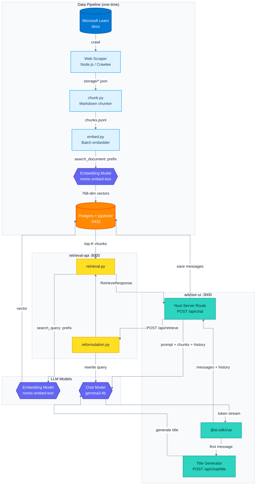

# AKS Architect AI

Prototype and Capstone Project for AI Engineering Bootcamp.

## Use Case

A customer who is new to Kubernetes and/or Azure wants to deploy an AKS cluster but needs help defining an architecture. This AI application combines RAG of official documents with human curation to advise the user:

- [X] Chatbot interface to answer questions - uses RAG of official docs.
- [ ] Interactive UI with questions for user to determine fundamental requirements, i.e. compliant industry vs startup, etc.
  - [x] Separate form UI
  - [ ] UI integrated into chat
- [ ] Architectural Decisions for specific components made by AI Agents.

## Components

This is a monorepo with many moving parts.

| Directory | Component | Description |
|:--|:--|:--|
| [`retrieval-api/`](./retrieval-api) | Retrieval Backend | Python [FastAPI](https://fastapi.tiangolo.com/) backend with `/api/retrieve` endpoint for RAG queries. |
| [`advisor-ui/`](./advisor-ui) | UI | NuxtJS app with streaming chat, which calls FastAPI endpoints |
| [`rag-pipeline/`](./rag-pipeline) | RAG Pipeline | Code to convert scraped docs into embeddings |
| [`web-scraper/`](./web-scraper) | Crawler | [Crawlee](https://github.com/apify/crawlee) JS Library for scraping web |
| [Postgres + pgvector](./docker-compose.dev.yaml) | Database | Vector search + chat session storage |
| [Ollama](https://ollama.com/) | LLM | Local LLM for testing purposes. |

## Commands

See [Makefile](./Makefile) for all commands.

### Scraping AKS Documentation

Configure which web pages are crawled in [`SOURCES.yaml`](./web-scraper/SOURCES.yaml)

```bash
# Clear old cache
make scraper/clean

# Run new crawl
make scraper/crawl
```

Then re-run RAG Pipeline (chunking, embeddings)

```bash
make rag-pipeline
```

And you can test it worked with `make pipeline/query`.

### Start Dev Environment

#### Step 1 - Start Ollama

Pull Ollama models and start service.

```bash
make ollama/pull
make ollama/start
```

Check if it's running with `pgrep -l ollama` or open [localhost:11434](http://localhost:11434)

#### Step 2 - Start Containers

This command starts up Postgres, Python `retrieval-api` backend and Nuxt.js `advisor-ui` frontend.

```bash
docker-compose -f docker-compose.dev.yaml up --build
```

Finally open [http://localhost:3000](http://localhost:3000) and use the chat interface.

---

## LLMs

Models used:

| Provider | Model | Environment | Purpose |
|:--|:--|:--|:--|
| Ollama | `nomic-embed-text` | Local | Embedding |
| Ollama | `gemma3:4b` | Local | Chat, title generation,  query reformulation |
| Anthropic | Sonnet 4.6 | Test | Chat LLM |
| Anthropic | Haiku 4.5 | Test | Title generation |

## Architecture Diagram

- Last updated 21 March
- Diagram provides some high level overview - unfortunately too complex for Mermaid.
- Models are configurable for different environemnts, e.g. dev vs prod.



---

## Misc.

Model Pricing for personal reference.

- [Anthropic Model Pricing](https://platform.claude.com/docs/en/about-claude/pricing)
- [Vercel AI Models Pricing](https://vercel.com/ai-gateway/models)
- [MSFT Foundry Pricing for Anthropic](https://marketplace.microsoft.com/en-us/product/anthropic.anthropic-claude-sonnet-4-6-offer?tab=Overview) - pricing is buried in Foundry portal
