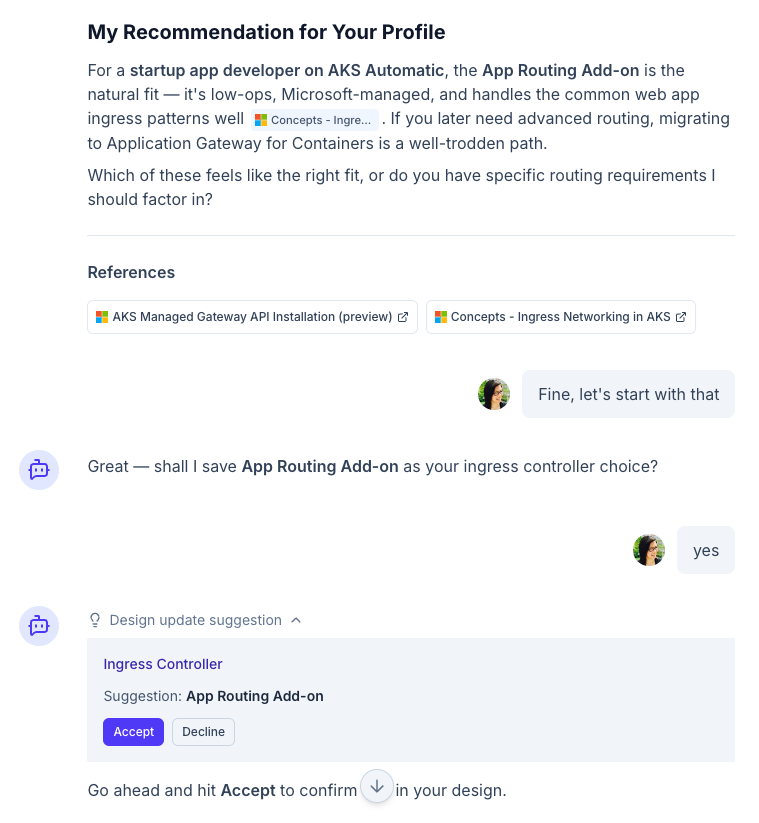
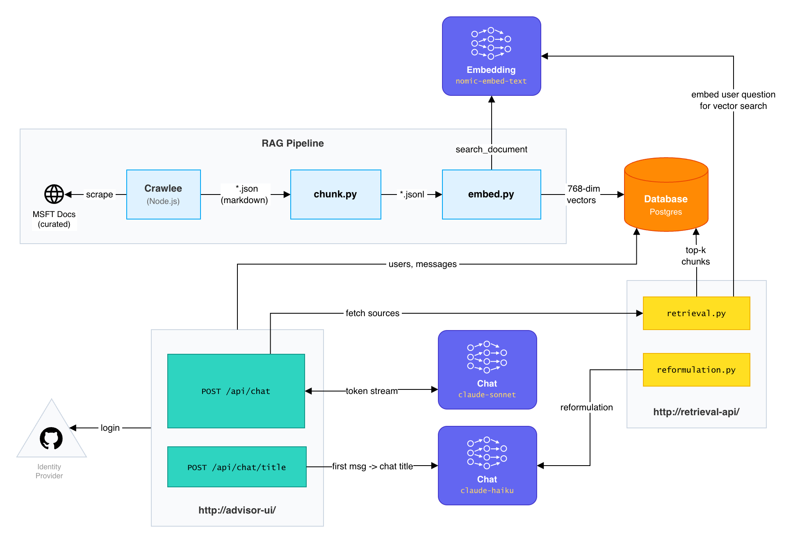

# AI Assistant for AKS

Capstone Project for [ByteByteAI Engineering Bootcamp](https://bytebyteai.com/) - built in 3 weeks in March 2026.

## Use Case

A customer who is new to Kubernetes and/or Azure wants to deploy an AKS cluster but needs help defining an architecture. This AI application combines RAG of official documents with human curation to advise the user:

| Feature Highlights | Preview |
|:--|:--|
| <ul><li>**RAG-grounded citations** — responses cite specific chunks from official Microsoft docs with inline `[n]` references</li><li>**Priority-boosted retrieval** — human-curated source scores ensure authoritative references surface even if not the closest vector match</li><li>**Personalized and interactive guidance** — user's architecture decisions and requirements are injected into the LLM context. User can interact both via text and UI through **LLM tools**.</li><li>**Modular context assembly** — system prompt is composed from interchangeable markdown sections + dynamic XML blocks, e.g. `<design>`, separating knowledge curation from application code</li></ul> |  |

See more features in [`advisor-ui/README.md`](./advisor-ui/) as well as the `README`s in [`rag-pipeline/`](./rag-pipeline), [`retrieval-api/`](./retrieval-api), and [`web-scraper/`](./web-scraper) subdirectories for implementation details.

> [!IMPORTANT]
> This project was created for experimentation with AI engineering, especially context engineering to provide new business value. It is **neither personal recommendations nor official Microsoft guidance**. Although grounded in official docs, always verify AI recommendations against sources.

## Architecture

N.B. Models are configurable for different environments, e.g. Ollama for dev vs Anthropic for prod.



#### Updates

- 30.03. - Added missing path between `retrieval.py` and `nomic-embed-text` for user question reformulation. 
- 29.03. - LLM proposes design updates via interactive Accept/Decline cards in chat ([`23dcfb0`](https://github.com/julie-ng/aks-architect-ai/commit/23dcfb0))
- 29.03. - Domain-filtered system prompt to stay within token rate limits ([`79212ce`](https://github.com/julie-ng/aks-architect-ai/commit/79212ce))
- 28.03. - LLM detects and acknowledges design changes mid-conversation ([`d9057f1`](https://github.com/julie-ng/aks-architect-ai/commit/d9057f1))
- 27.03. - Design context injected into chat (links design to conversation) ([`0610636`](https://github.com/julie-ng/aks-architect-ai/commit/0610636))
- 26.03. - Switched reformulation to Haiku, saving ~3 sec. in retrieval latency ([`ecb459d`](https://github.com/julie-ng/aks-architect-ai/commit/ecb459d))

## Project Structure

This is a monorepo with many moving parts.

| Directory | Component | Description |
|:--|:--|:--|
| [`advisor-ui/`](./advisor-ui) | UI | NuxtJS app with streaming chat, which calls FastAPI endpoints |
| [`retrieval-api/`](./retrieval-api) | Retrieval Backend | Python [FastAPI](https://fastapi.tiangolo.com/) backend with `/api/retrieve` endpoint for RAG queries. |
| [`rag-pipeline/`](./rag-pipeline) | RAG Pipeline | Code to convert scraped docs into embeddings |
| [`web-scraper/`](./web-scraper) | Crawler | [Crawlee](https://github.com/apify/crawlee) JS Library for scraping web |
| [Postgres + pgvector](./docker-compose.dev.yaml) | Database | Vector search + chat session storage |
| [Ollama](https://ollama.com/) | LLM | Local LLM for testing purposes. |

## LLMs

Models are configurable per environment via `AI_PROVIDER` env var.

| Task | Ollama | Anthropic |
|:--|:--|:--|
| Embedding | `nomic-embed-text` | - |
| Tagging Chunks | `gemma3:4b` | - |
| Chat | `gemma3:4b` | Sonnet 4.6 |
| Chat title generation | `gemma3:270m` | Haiku 4.5 |
| Query reformulation | `gemma3:270m` | Haiku 4.5 |

> [!TIP]
> Ultimately switched all runtime models to Anthropic for performance and quality reasons. For chat `gemma3:4b` (largest my M3 MacBook Pro can run comfortably) was fine with RAG and citing sources. But it couldn't properly follow directions in long system prompt (~10k tokens) and tools.

## RAG Pipeline

The pipeline grounds the LLM in official AKS documentation from [https://learn.microsoft.com](https://learn.microsoft.com)

### Scrape Docs

Configure which web pages are crawled in [`SOURCES/`](./web-scraper/SOURCES/) directory.

```bash
# Clear old cache
make scraper/clean

# Run new crawl
make scraper/crawl
```

### Run Pipeline

> [!NOTE]
> Requires the running Postgres database. See instructions below on `docker-compose.dev.yaml` setup.

Then re-run RAG Pipeline (chunking, embeddings).

```bash
make rag-pipeline
```

And you can test it worked with `make pipeline/query`.

## Local Development

See [Makefile](./Makefile) for all commands.

### Step 1 - Start Ollama

Install [Ollama](https://ollama.com/). Then pull models and start service.

```bash
make ollama/pull
make ollama/start
```

Check if it's running with `pgrep -l ollama` or open [localhost:11434](http://localhost:11434)

### Step 2 - Setup environment variables

- Rename `.env.sample` into `.env` and configure your values. Most should be self-explanatory.
- `NUXT_SESSION_PASSWORD` is a minimum 32 character long string used to encrypt and sign session cookies.

### Step 3 - Create GitHub OAuth App

Because the application only works with login, you need to create a GitHub OAuth App

1. Create an OAuth App at [github.com/settings/apps/new](https://github.com/settings/apps/new)
2. Add `http://localhost:3000/api/auth/github` as the Callback URL
3. Update the `.env` with your GitHub App's Client ID and Secret

### Step 4 - Start Containers

This command starts up Postgres, Python `retrieval-api` backend and Nuxt.js `advisor-ui` frontend.

```bash
docker compose -f docker-compose.dev.yaml up --build
```

### Step 5 - Scrape Docs

If you haven't yet, scrape the docs and run the pipeline to populate the database with chunks for RAG.

```bash
make scraper/crawl && make rag-pipeline
```

### Step 6 - Open Browser

Finally, open [http://localhost:3000](http://localhost:3000) and use the chat interface, which should look something like this:


