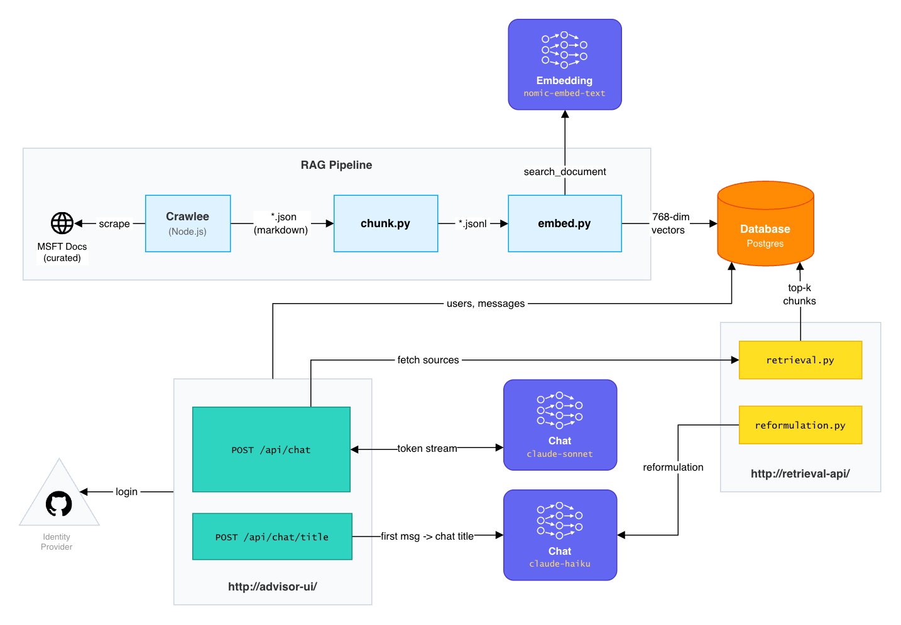
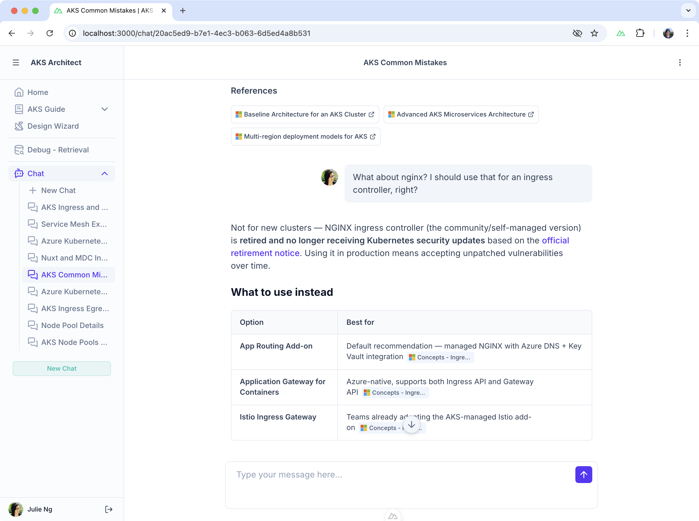

# AKS Architect AI

Prototype and Capstone Project for AI Engineering Bootcamp.

## Use Case

A customer who is new to Kubernetes and/or Azure wants to deploy an AKS cluster but needs help defining an architecture. This AI application combines RAG of official documents with human curation to advise the user:

- [X] Chatbot interface to answer questions - uses RAG of official docs.
- [ ] Interactive UI with questions for user to determine fundamental requirements, i.e. compliant industry vs startup, etc.
  - [x] Separate form UI
  - [ ] UI integrated into chat
- [ ] Architectural Decisions for specific components made by AI Agents.

> [!IMPORTANT]
> This is a prototype application for experimenting with AI engineering, especially context engineering to provide new business value. It is **not official Microsoft guidance**. Always verify AI recommendations against sources.

## Architecture

N.B. Models are configurable for different environments, e.g. Ollama for dev vs Anthropic for prod.



#### Updates

- 26.03. - Switched reformulation to Haiku, saving ~3 sec. in retrieval latency

## Project Structure

This is a monorepo with many moving parts.

| Directory | Component | Description |
|:--|:--|:--|
| [`advisor-ui/`](./advisor-ui) | UI | NuxtJS app with streaming chat, which calls FastAPI endpoints |
| [`retrieval-api/`](./retrieval-api) | Retrieval Backend | Python [FastAPI](https://fastapi.tiangolo.com/) backend with `/api/retrieve` endpoint for RAG queries. |
| [`rag-pipeline/`](./rag-pipeline) | RAG Pipeline | Code to convert scraped docs into embeddings |
| [`web-scraper/`](./web-scraper) | Crawler | [Crawlee](https://github.com/apify/crawlee) JS Library for scraping web |
| [Postgres + pgvector](./docker-compose.dev.yaml) | Database | Vector search + chat session storage |
| [Ollama](https://ollama.com/) | LLM | Local LLM for testing purposes. |

## LLMs

Models used/considered

| Provider | Model | Environment | Purpose |
|:--|:--|:--|:--|
| Ollama | `nomic-embed-text` | Local | Embedding |
| Ollama | `gemma3:4b` | Local | Chat, title generation,  query reformulation |
| Anthropic | Sonnet 4.6 | Test | Chat LLM |
| Anthropic | Haiku 4.5 | Test | Title generation |

## RAG Pipeline

### Scrape Docs

Configure which web pages are crawled in [`SOURCES.yaml`](./web-scraper/SOURCES.yaml)

```bash
# Clear old cache
make scraper/clean

# Run new crawl
make scraper/crawl
```

### Run Pipeline

> [!NOTE]
> Requires the running Postgres database. See instructions below on `docker-compose.dev.yaml` setup.

Then re-run RAG Pipeline (chunking, embeddings).

```bash
make rag-pipeline
```

And you can test it worked with `make pipeline/query`.

## Local Development

See [Makefile](./Makefile) for all commands.

### Step 1 - Start Ollama

Install [Ollama](https://ollama.com/). Then pull models and start service.

```bash
make ollama/pull
make ollama/start
```

Check if it's running with `pgrep -l ollama` or open [localhost:11434](http://localhost:11434)

### Step 2 - Setup environment variables

- Rename `.env.sample` into `.env` and configure your values. Most should be self-explanatory.
- `NUXT_SESSION_PASSWORD` is a minimum 32 character long string used to encrypt and sign session cookies.

### Step 3 - Create GitHub OAuth App

Because the application only works with login, you need to create a GitHub OAuth App

1. Create an OAuth App at [github.com/settings/apps/new](https://github.com/settings/apps/new)
2. Add `http://localhost:3000/api/auth/github` as the Callback URL
3. Update the `.env` with your GitHub App's Client ID and Secret

### Step 4 - Start Containers

This command starts up Postgres, Python `retrieval-api` backend and Nuxt.js `advisor-ui` frontend.

```bash
docker compose -f docker-compose.dev.yaml up --build
```

### Step 5 - Scrape Docs

If you haven't yet, scrape the docs and run the pipeline to populate the database with chunks for RAG.

```bash
make scraper/crawl && make rag-pipeline
```

### Step 6 - Open Browser

Finally, open [http://localhost:3000](http://localhost:3000) and use the chat interface, which should look something like this:


