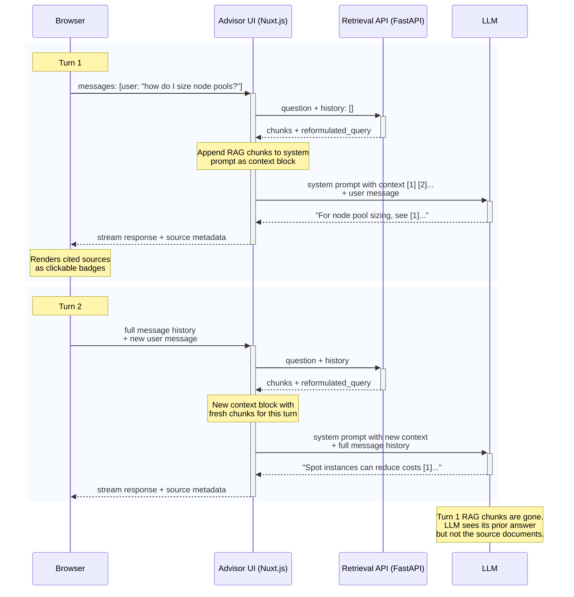

# Advisor UI

Nuxt 4 streaming chat UI for the AKS Architect advisor.

## Stack

- [Advisor UI](./) is a Nuxt 4 app with:
  - Frontend UI
  - Nuxt Backend for Frontend `/api/chat` route that handles communications to:
    - RAG Service (Advisor API)
    - LLM
- [RAG Service](./../retrieval-api/)
- [AI SDK](https://ai-sdk.dev/) (`@ai-sdk/vue`) for chat management and streams LLM responses
 
## Chunks in Request-Response Flow

**Chunks - when and where?:**
- RAG chunks are appended to the system prompt as a `<context>` block — user messages are not modified
- Only the current turn's RAG chunks are visible to the LLM — previous turns' chunks are not carried forward
- Source metadata (title, URL) is sent to the browser via message metadata on stream finish
- The browser renders only sources the LLM actually cited with `[n]` references

