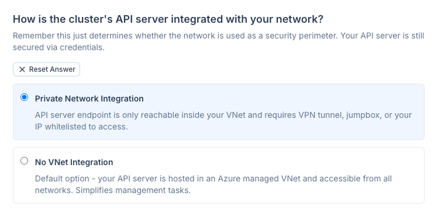
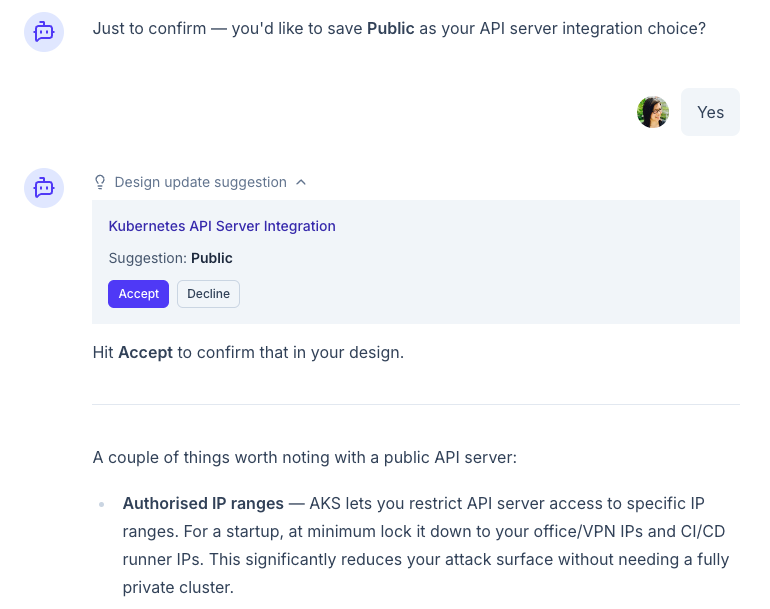
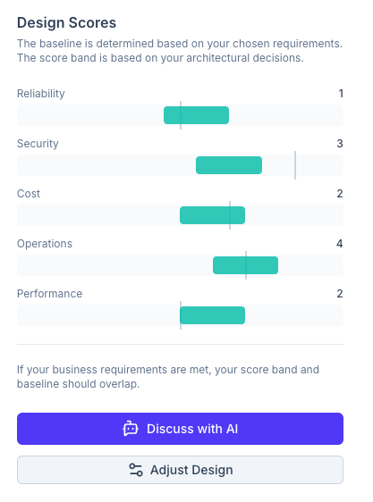
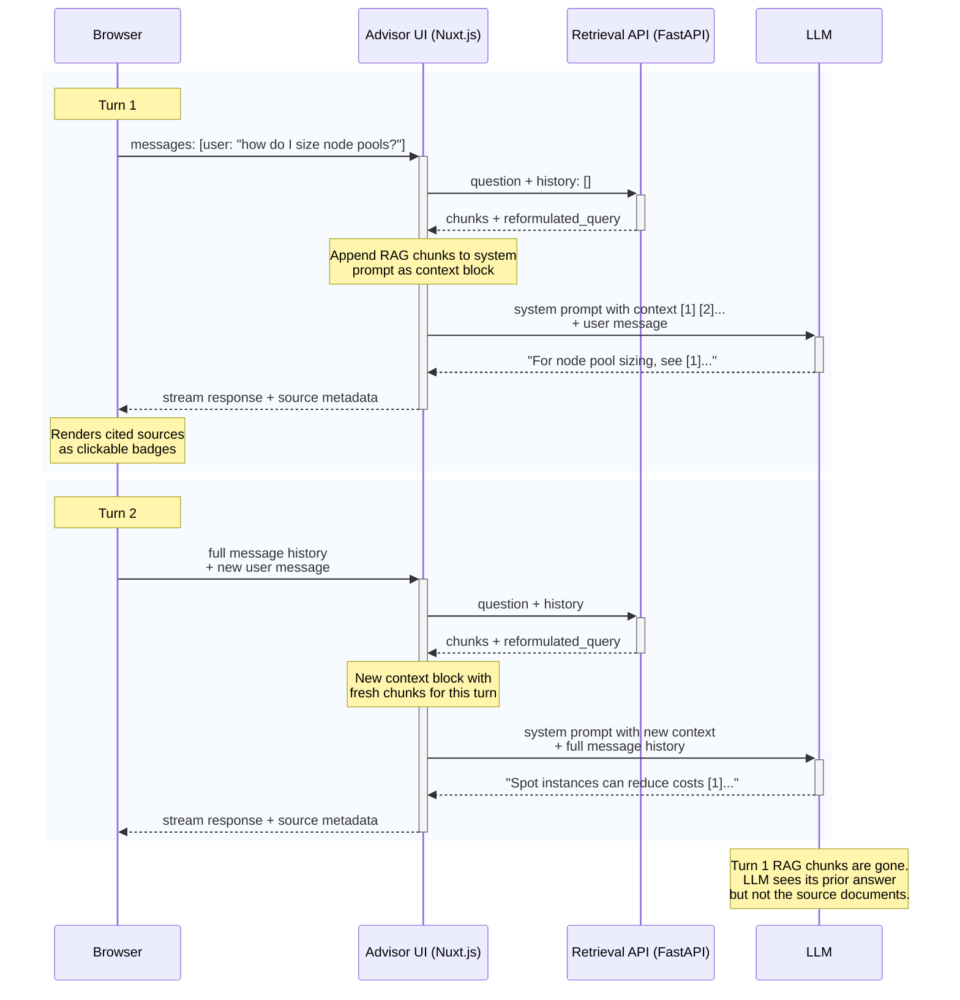

# Advisor UI

Nuxt 4 streaming chat UI for the AKS Architect advisor.

### Features

- **RAG-grounded chat** — streams LLM responses with inline `[n]` citations linked to official Microsoft docs
- **Design-aware context** — links architecture designs to chat sessions, injecting design state into the system prompt
- **Design change detection** — detects when a design is updated mid-conversation and signals the LLM to acknowledge changes
- **Interactive design proposals** — LLM proposes saving architecture decisions via `proposeDesignUpdate` tool, rendered as Accept/Decline cards
- **Domain-filtered system prompt** — keyword heuristics select only relevant knowledge domains (~6K tokens vs ~12K), staying within rate limits
- **Design framework UI** — interactive forms for decisions and requirements, driven by Nuxt Content markdown with YAML frontmatter

### Stack

- [Advisor UI](./) is a Nuxt 4 app with:
  - Frontend UI
  - Nuxt Backend for Frontend `/api/chat` route that handles communications to:
    - Retrieval API (FastAPI)
    - LLM
- [AI SDK](https://ai-sdk.dev/) (`@ai-sdk/vue`) for chat management and streaming LLM responses
- [Nuxt Content](https://content.nuxt.com/) for design framework definitions (decisions, requirements)
- [Drizzle ORM](https://orm.drizzle.team/) for chat sessions and design persistence in Postgres

## Product Value Proposition

### Goal
I wanted to use AI to enable personalized guidance for the user's own goals. Instead of a one-size-fits all checklist, the application asks the user for their business requirements and architectural decisions.

### How to Personalize Architectures

The user can provide context via a classical form UI or inline in chat.

| via Form UI | inline via LLM suggestions |
|:--|:--|
|  |  |
| User can fill out requirements and decisions in a classical form UI | During conversation, LLM can suggest an answer to a question/requirement and prompt the user to confirm. |


### Result for User

Designs are given a score based on the Microsoft [Well Architected Framework (WAF)](https://learn.microsoft.com/en-us/azure/well-architected/) pillars of reliability, security, cost, operations and performance.

- **Baseline Score** - are the vertical grey lines that show a target based on the user's requirements.
- **Green Bands** - show where the given decisions would place their scores.

In a good architecture, the green bands and baselines overlap. In example below, the chosen architecture would not meet the user's security requirements.


  
> [!IMPORTANT]
> This is a capstone project for learning. The framework scores were set by gut feeling and adjusted until correlations _seemed_ directionally correct. **Do not read into the specific values** — they are not based on formal research or official guidance.

## Domain Knowledge in Markdown

As a former enterprise architect, I view knowledge in relationships. Instead of relying on databases, I prefer to use structured YAML Frontmatter via [Nuxt Content](https://content.nuxt.com/) not just as a content management system (CMS) but also to define my "architecture framework".

### Requirements Schema

Each "Requirement" has:

- `question`
- `question_type`
- `answers` array, each with `waf_baseline` scores.

<details>
  <summary>
    Example Schema (YAML) - Tenancy Model, single or multiple?
  </summary>

```yaml
---
title: Tenancy Model
spec:
  question: What is your tenancy model?
  description: Different tenancy models have different security boundaries, cost isolation, and operational complexity.
  title: Tenancy Model
  question_type: radio
  answers:
  - key: single-tenant
    label: Single Tenant
    description: |
      Cluster used by a **single team** or organization with same security and cost boundary.
    implications:
      - security-requirements: lower
      - ops-team: self-managed
    waf_baseline:
      security: 5
      cost: 5
      operations: 5
      performance: 2

  - key: multi-tenant
    label: Multi-Tenant
    description: |
      Cluster used by **multiple teams** with different security and cost boundaries.
    implications:
      - security-requirements: highest
      - ops-team: recommended
    waf_baseline:
      reliability: -5
      security: -5
      operations: 10
      performance: 5
---
```
</details>

For full schema, see JSON overview for humans at [localhost:3000/api/_debug/schema/requirements](http://localhost:3000/api/_debug/schema/requirements)

### Design Schema

Each "Decision" has:

- `question`
- `question_type` 
- `answers` array, each with `waf_impact` scores.

<details>
  <summary>
    Example Schema (YAML) - API Server Integration, public or private?
  </summary>

```yaml
---
title: API Server Integration
spec:
  title: Kubernetes API Server Integration
  description: |
    Remember this just determines whether the network is used as a security perimeter. Your API server is still secured via credentials.
  question: |
    How is the cluster's API server integrated with your network?
  question_type: radio
  reference:
    title: Create an AKS cluster with API Server VNet Integration
    url: https://learn.microsoft.com/en-us/azure/aks/api-server-vnet-integration
  answers:
  - key: private
    label: Private Network Integration
    description: |
      API server endpoint is only reachable inside your VNet and requires VPN tunnel, jumpbox, or your IP whitelisted to access.
    waf_impact:
      reliability: 0
      security: 10
      cost: 0
      operations: 5
      performance: 0
      
  - key: public
    label: No VNet Integration
    description: |
      Default option - your API server is hosted in an Azure managed VNet and accessible from all networks. Simplifies management tasks.
    waf_impact:
      reliability: 0
      security: 0
      cost: 0
      operations: 0
      performance: 0
---
```
</details>

For full schema, see JSON overview for humans at [localhost:3000/api/_debug/schema/decisions](http://localhost:3000/api/_debug/schema/decisions)

> [!NOTE]
> The `implications` properties, which could limit available architectural options exists in the schema but was never implemented.

---

## LLM Flow

### System Prompt

The system prompt is assembled at runtime by [`assemble-system-prompt.ts`](./server/utils/assemble-system-prompt.ts) from markdown files in [`content/system-prompt/`](./content/system-prompt.example/). It stitches together a core prompt with domain-specific knowledge sections (networking, security, operations, etc.), RAG context, and optional design state — all injected as XML-tagged blocks (`<context>`, `<design>`, `<framework>`).

#### Prompt Structure

- Core System Prompt, e.g. role, greeting
- Knowledge Domain(s) - helps LLM frame conversations
- RAG Chunks - for citations
- Design block - if chat is linked to an architectural design
- Framework - Design questions and answers LLM can use to help user define their design.

For details, see [system-prompt.example/README.md](./content/system-prompt.example/README.md)

> [!NOTE]
> **Learning**: to stay within Anthropic's 30K input tokens/min rate limit, [`server/utils/select-domains.ts`](./server/utils/select-domains.ts) uses keyword heuristics to include only relevant domain sections per question, reducing the system prompt from ~12K tokens to ~6K.

### User Message Flow

- RAG chunks are appended to the system prompt as a `<context>` block — user messages are not modified
- Only the current turn's RAG chunks are visible to the LLM — previous turns' chunks are not carried forward
- Source metadata (title, URL) is sent to the browser via message metadata on stream finish
- The browser renders only sources the LLM actually cited with `[n]` references


