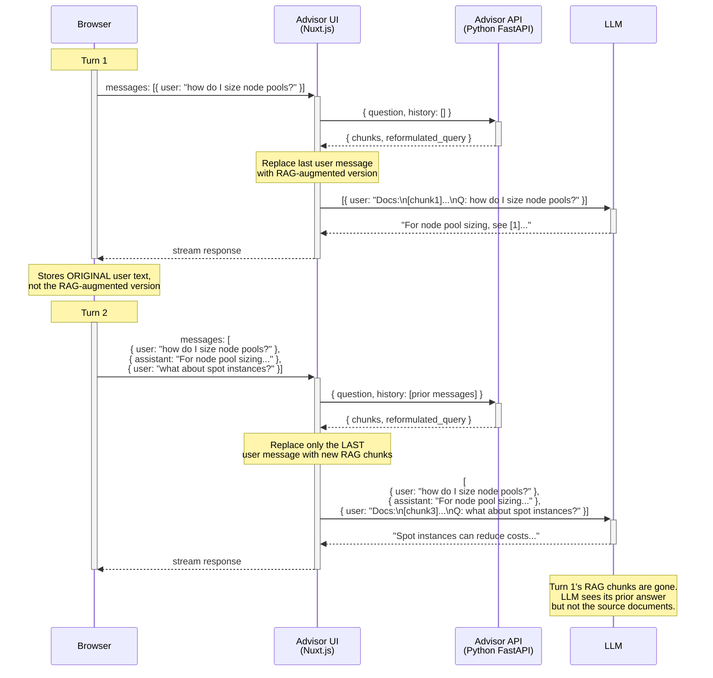

# Advisor UI

Nuxt 3 streaming chat UI for the AKS Architect advisor.

## Stack

- [Advisor UI](./) is a Nuxt 3 app with:
  - Frontend UI
  - Nuxt Backend for Frontend `/api/chat` route that handles communications to:
    - RAG Service (Advisor API)
    - LLM
- [RAG Service](./../retrieval-api/)
- [AI SDK](https://ai-sdk.dev/) (`@ai-sdk/vue`) for chat management and streams LLM responses
 
## Chunks in Request-Response Flow

Sequence flow as of 17 March.

**Chunks - when and where?:** 
- Only the current turn's RAG chunks are visible to the LLM. 
- Previous turns' chunks are not carried forward
- Browser stores the original user text, not the RAG-augmented version. 
- This is intentional: once the LLM has generated a cited response, the raw chunks have served their purpose.

