# Architecture: Chat + Design with mixed context

## Overview

This app has an LLM chat linked 1:1 with an architectural design. Users make design decisions through both the design UI and through chat (via LLM tool calls). The chat includes design state as prompt context, persisted per-message as a point-in-time snapshot.

Validation of design decisions is not real-time — users make decisions freely, then initiate an explicit "assessment" flow to validate them against backend domain rules.

The chat is powered by **AI SDK v6** (`ai` + `@ai-sdk/vue`). The SDK owns message state, streaming lifecycle, and the binary transport protocol between client and server. We do not wrap the SDK in a custom Chat model — instead, composables add behavior on top of the SDK's Chat class.

## Diagrams

See the companion SVG files for visual reference:

- `chat-design-layers-revised.svg` — Layer structure showing what owns what
- `chat-design-data-flows-revised.svg` — Data flow for "user sends message" and "LLM sets decision via tool call"

## Core entities

```ts
interface ChatMessage {
  id: string
  role: 'user' | 'assistant' | 'tool_result'
  content: string
  systemContext?: Record<string, unknown>  // point-in-time design snapshot (opaque blob)
  sources?: RetrievalSource[]              // RAG retrieval sources
  createdAt: string
}

interface ChatSessionData {
  id: string
  designId: string
  title: string | null
  messages: ChatMessage[]
}

interface DesignData {
  id: string
  chatId: string
  decisions: Record<string, string>  // questionId → chosen option
  metadata: Record<string, unknown>
}

interface AssessmentResult {
  valid: boolean
  issues: Array<{
    questionId: string
    option: string
    reason: string
    negatedBy?: { questionId: string; option: string }
  }>
}
```

## Layer responsibilities

| Layer | Location | Responsibility | Knows about |
|---|---|---|---|
| Vue component | `pages/`, `components/` | Template rendering, binds Nuxt UI to composable outputs | Composable only |
| `useChatWithDesign` | `composables/` | Orchestrates chat + design, injects design context, handles tool results | `useChatSession`, Design model, design store |
| `useChatSession` | `composables/` | Wraps AI SDK Chat, title generation, persistence via callbacks | AI SDK Chat, chat store |
| AI SDK Chat | `@ai-sdk/vue` | Message state, streaming lifecycle, transport protocol | External — not our code |
| Design model | `models/` | Per-instance behavior: decisions, domain logic, `toPromptContext()` | Nothing — persistence injected via callbacks |
| Stores | `stores/` | JSON cache + API endpoint definitions | API paths and data types only |



## The AI SDK constraint

The AI SDK Chat class is **not replaceable** with a custom model. It owns:

- Reactive `chat.messages` array
- Streaming lifecycle (`chat.status`: ready → submitted → streaming → ready)
- Binary streaming transport (`toUIMessageStreamResponse`)
- Error handling (`chat.error`)
- Stop/regenerate controls

Nuxt UI components (`UChatMessages`, `UChatPrompt`, `UChatPromptSubmit`) bind directly to the AI SDK Chat instance. The component reads `chat.messages` and `chat.status` from the SDK — not through the composable.

The AI SDK Chat is **client-only** — created inside `onMounted`. The chat store handles SSR data loading separately via `useAsyncData`.

## Design model

The Design model is the only custom model class. 

Key rules:
- Zero framework imports — fully testable without mocking Vue or Pinia
- Persistence is injected, never imported — no circular dependencies
- `toPromptContext()` returns an opaque blob; the chat domain never parses it

<details>
  <summary><h5><code>models/Design.ts</code></h5></summary>
  
```ts
// models/Design.ts

export interface DesignPersistence {
  save: (id: string, changes: Partial<DesignData>) => Promise<DesignData>
}

export class Design {
  private _data: DesignData
  private _persist: DesignPersistence

  constructor(data: DesignData, persist: DesignPersistence) { /* clone data, store persist */ }

  // Read-only getters
  get id, chatId, decisions, isDirty

  // Mutations — no validation, user decides freely
  setDecision(questionId: string, option: string): void
  setDecisions(changes: Record<string, string>): void   // batch, for LLM tool calls
  clearDecision(questionId: string): void

  // Serializable snapshot for chat system prompt
  // Returns opaque Record<string, unknown> — chat never knows this is "design" data
  toPromptContext(): Record<string, unknown>

  // Delegates to injected persist callback → store.update()
  async save(): Promise<void>
}
```  
</details>


## Stores

Stores are dumb JSON caches with API endpoint definitions. They never import model classes — only data types.

Key rules:
- Stores are the **single source of truth** for API paths and HTTP methods
- Stores hold only raw JSON — never class instances
- Stores may import `DesignData` / `ChatSessionData` types, never model classes

<details>
  <summary><h5><code>stores/chat.ts</code></h5></summary>

```ts
// stores/chat.ts — all chat HTTP endpoints live here
export const useChatStore = defineStore('chat', () => {
  const byId = ref<Record<string, ChatSessionData>>({})

  async function fetchOne(id: string)    // GET  /api/sessions/{id}
  async function update(id, changes)     // PATCH /api/sessions/{id}
  async function generateTitle(id)       // POST /api/sessions/{id}/title
  async function persistMessages(id, messages, systemContext)
                                         // POST /api/sessions/{id}/messages
  function get(id: string)               // local cache read

  return { byId, fetchOne, update, generateTitle, persistMessages, get }
})
```

```ts
// stores/designs.ts — all design HTTP endpoints live here
export const useDesignStore = defineStore('designs', () => {
  const byId = ref<Record<string, DesignData>>({})

  async function fetchOne(id: string)    // GET  /api/designs/{id}
  async function update(id, changes)     // PATCH /api/designs/{id}
  async function assess(id: string)      // POST /api/designs/{id}/assess
  function get(id: string)               // local cache read
  function updateCache(id, data)         // manual cache update after tool calls

  return { byId, fetchOne, update, assess, get, updateCache }
})
```
</details>

## Composables

### `useChatSession()` — chat-only, no design knowledge

Wraps the AI SDK Chat instance and adds persistence behavior via callbacks. Components that don't need design integration can use this directly.

Key: the composable **does not "inject persist"** into the AI SDK Chat. It configures the SDK's `onFinish` callback to call the store. The relationship is "wraps and configures," not "injects a dependency."

<details>
  <summary><h5><code>composables/useChatSession.ts</code></h5></summary>

```ts
// composables/useChatSession.ts
export function useChatSession(sessionId: string) {
  const chatStore = useChatStore()

  // SSR: load session data for hydration
  const { pending } = useAsyncData(`session-${sessionId}`, () => chatStore.fetchOne(sessionId))

  // Client-only: create AI SDK Chat instance in onMounted
  const chat = ref<Chat | null>(null)

  onMounted(() => {
    chat.value = new Chat({
      // AI SDK transport configuration
      // ...

      // Persistence via callback — NOT a custom model, just an SDK hook
      onFinish: async (messages) => {
        await chatStore.persistMessages(sessionId, messages, currentContext)

        // Title generation after first message
        if (needsTitle) await chatStore.generateTitle(sessionId)
      },
    })
  })

  // Expose raw AI SDK Chat instance for template bindings
  // AND higher-level actions for the composable layer above
  return {
    chat,           // AI SDK instance — component binds chat.messages, chat.status directly
    pending,
    submit,         // wrapper that sets context before calling chat.submit()
  }
}
```
</details>

### `useChatWithDesign()` — orchestrates both domains

> [!IMPORTANT]
> This is the **only layer** that knows about both chat and design.

Composes `useChatSession()` with the design model and store. 

<details>
  <summary><h5><code>composables/useChatSession.ts</code></h5></summary>
  
```ts
// composables/useChatWithDesign.ts
export function useChatWithDesign(sessionId: string) {
  const { chat, pending: chatPending, submit } = useChatSession(sessionId)
  const designStore = useDesignStore()

  // Load design alongside chat session
  const { pending: designPending } = useAsyncData(/* fetch design by session's designId */)

  // Persistence interface injected into model — composable bridges store → model
  const designPersist: DesignPersistence = {
    save: (id, changes) => designStore.update(id, changes),
  }

  // Reactive model instance — rebuilt from store data whenever it changes
  const design = computed(() => {
    const data = designStore.get(/* designId */)
    return data ? Design.from(data, designPersist) : null
  })

  // Send message with design context snapshot
  async function sendMessage(message: string) {
    const context = design.value?.toPromptContext()
    await submit(message, context)
  }

  // Tool call handlers — same path whether human or LLM initiates
  async function handleToolSetDecision(questionId, option) { /* design.setDecision → design.save */ }
  function handleToolGetDesign() { /* design.toPromptContext() */ }

  // Assessment — user-initiated, async validation against backend rules
  async function runAssessment() { /* persist if dirty, then designStore.assess() */ }

  return {
    chat, design, sendMessage,
    handleToolSetDecision, handleToolGetDesign,
    runAssessment, assessing, assessmentResult,
  }
}
```

</details>

## Tool call processing

When the LLM response stream contains tool calls, the AI SDK invokes registered tool handlers. A tool router maps tool names to composable methods.

### Expected tool call shapes

```ts
// get_current_design  — Input: none                    → Output: design prompt context
// set_decision        — Input: { questionId, option }  → Output: { success, error? }
// set_decisions       — Input: { decisions }            → Output: Array<{ questionId, success, error? }>
```

### Tool router

```ts
// utils/toolCallRouter.ts
// Pure function — receives handler callbacks from the composable
export function createToolRouter(handlers: ToolHandlers) {
  return async function routeToolCall(toolName: string, toolInput: Record<string, unknown>) {
    switch (toolName) {
      case 'get_current_design':   return handlers.handleToolGetDesign()
      case 'set_decision':         return handlers.handleToolSetDecision(/* ... */)
      case 'set_decisions':        /* batch: iterate and call handleToolSetDecision for each */
      default:                     return { error: `Unknown tool: ${toolName}` }
    }
  }
}
```

### Component wiring

```vue
<script setup>
const { chat, design, sendMessage, handleToolSetDecision, handleToolGetDesign } = useChatWithDesign(sessionId)
const toolRouter = createToolRouter({ handleToolGetDesign, handleToolSetDecision })
</script>

<template>
  <!-- Nuxt UI components bind directly to AI SDK Chat instance -->
  <UChatMessages :messages="chat?.messages" />
  <UChatPrompt @submit="sendMessage" :status="chat?.status" />
</template>
```

## Dependency graph

```
Component (pages/chat/[id].vue)
  │  Binds Nuxt UI directly to AI SDK Chat instance (chat.messages, chat.status)
  │
  └→ useChatWithDesign (composable)
       ├→ useChatSession (composable)
       │    ├→ AI SDK Chat      ← external, not our code, client-only
       │    └→ chatStore        ← imports ChatSessionData type only
       │
       ├→ Design model          ← no imports from chat, no store imports, no framework imports
       └→ designStore           ← imports DesignData + AssessmentResult types only

  └→ createToolRouter (utility)
       ← pure function, receives handler callbacks from composable
```

Every arrow points down. No cycles. The Design model is a leaf node with zero application dependencies. The AI SDK Chat is an external dependency, not a custom model.

---

# Data Flows



## SSR / client-only boundary

- **Stores** hold raw JSON → serialized into Nuxt hydration payload automatically
- **AI SDK Chat** is client-only — created in `onMounted`, manages streaming connections
- **Chat store** handles SSR data loading via `useAsyncData` separately from the SDK
- **Design model** instances are created inside `computed()` — rebuilt on client from hydrated store data, never stored in Pinia or `useState`
- **`systemContext`** on ChatMessage is persisted as an opaque JSON blob by the backend; the frontend never interprets it except to display it

## Data flow: user sends message

1. User types message in `UChatPrompt`
2. `useChatWithDesign.sendMessage()` snapshots design via `design.toPromptContext()`
3. `useChatSession.submit()` passes message + context to AI SDK `Chat.submit()`
4. AI SDK streams request to backend via binary transport protocol
5. Backend: reformulates query (Haiku), retrieves RAG chunks, assembles system prompt with context snapshot, streams LLM response
6. AI SDK progressively assembles response → UI updates reactively via `chat.messages`
7. On stream completion, `onFinish` callback calls `chatStore.persistMessages()` with the context snapshot
8. If first message, `chatStore.generateTitle()` runs

## Data flow: LLM sets decision via tool call

1. LLM response stream includes a `set_decision` tool invocation
2. AI SDK parses the tool call and invokes the registered tool handler
3. Tool router dispatches to `useChatWithDesign.handleToolSetDecision()`
4. Composable calls `design.setDecision()` then `design.save()`
5. `design.save()` delegates to injected callback → `designStore.update()` → `PATCH /api/designs/{id}`
6. Store cache updates → `design` computed re-evaluates → fresh model instance → UI reflects new decision
7. Tool result flows back to AI SDK → LLM continues its response with the result

Both flows use the same Design model path — UI-initiated and LLM-initiated changes are identical.

## File structure

```
models/
  Design.ts                # Design class + DesignData + DesignPersistence interfaces

stores/
  chat.ts                  # Chat session API endpoints + JSON cache
  designs.ts               # Design API endpoints + JSON cache + assess endpoint

composables/
  useChatSession.ts        # Wraps AI SDK Chat, title gen, persistence callbacks
  useChatWithDesign.ts     # Composes useChatSession + design model + tool handling

utils/
  toolCallRouter.ts        # Routes LLM tool calls to composable handlers

types/
  assessment.ts            # AssessmentResult type
```
