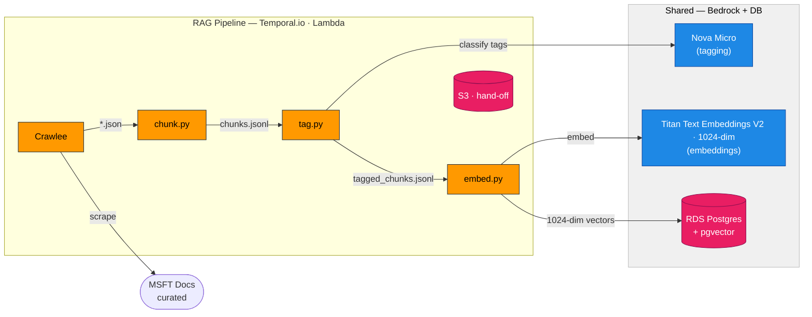
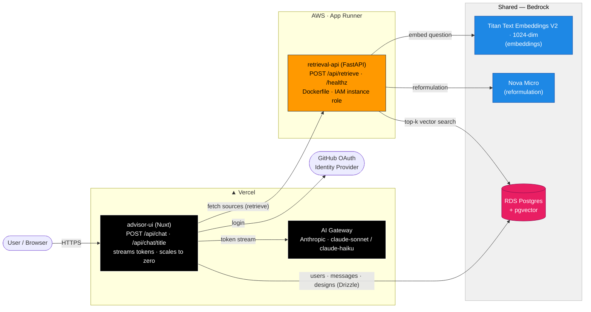

# Deployment Architecture — AWS + Vercel (Demo)

Deployment topology for the hosted demo. Decisions locked 2026-07-16.

- **Vercel:** `advisor-ui` (Nuxt) only.
- **AWS App Runner:** `retrieval-api` (FastAPI, existing Dockerfile).
- **AWS:** RDS Postgres + pgvector (public VPC) + Bedrock (Titan Embeddings V2 + Nova Micro) + Temporal-invoked Lambda RAG pipeline.

## 1. RAG Pipeline (offline)

Runs only on crawl. Temporal.io-orchestrated Lambdas hand off via S3. `tag.py` classifies chunks via Bedrock Nova Micro; `embed.py` embeds via Bedrock Titan and writes vectors to the shared store.

## 2. Runtime components (online)

Per-request chat flow. advisor-ui on Vercel, retrieval-api on AWS App Runner, both reading the shared store + embedding model.

## Notes / rationale

- **advisor-ui on Vercel** — stateless, streams over one HTTP POST (no WebSockets), free HTTPS, scales to zero. Secrets (Postgres URL, GitHub OAuth, session password) as Vercel env vars.
- **Chat LLM via Vercel AI Gateway** — Anthropic (claude-sonnet / claude-haiku) routed through Vercel's AI Gateway for cost control + observability, not direct-to-Anthropic. This is the only Anthropic usage in the system.
- **retrieval-api on App Runner** — right abstraction for one stateless HTTP container: runs the existing Dockerfile as-is (no ASGI adapter, no ALB, no ECS cluster/task-defs), built-in free HTTPS + autoscaling, **IAM instance role** for Bedrock (no stored AWS keys). Keeps min-1 instance warm → does not scale to zero; its persistent psycopg pool keeps Aurora warm too (accepted for a demo).
- **RDS Postgres + pgvector (`db.t4g.micro`), public VPC** — deliberately public (not VPC-private) because advisor-ui on Vercel must reach it. Public VPC also avoids NAT Gateway (~$32/mo) and ALB (~$16/mo). Region co-located with App Runner + Bedrock. (Chosen over Aurora Serverless v2: App Runner's warm psycopg pool would pin connections and defeat scale-to-zero anyway; a warm/predictable DB is preferred for a demo.)
- **retrieval-api is 100% Bedrock** — **Titan Text Embeddings V2 @ 1024-dim** for embeddings (replaces local Ollama `nomic-embed-text` @ 768; requires re-embedding + dropping nomic prefixes) and **Nova Micro** for query reformulation (moved off Anthropic — cheapest Bedrock text model, fractions of a cent at demo volume, same InvokeModel/IAM/region as embeddings → one auth story, no Anthropic key in retrieval-api).
- **RAG pipeline is also 100% Bedrock** — Crawlee → chunk → **tag** (Bedrock Nova Micro) → embed (Bedrock Titan) as Temporal.io-invoked Lambdas, S3 hand-off between stages, scales to zero (runs only on crawl). No local Ollama needed. Note: Nova requires the `eu.amazon.nova-micro-v1:0` cross-region inference-profile id in eu-west-1 (bare id fails); Titan uses the bare id.
- **Cost** — ~$20–25/mo for the AWS data plane (App Runner warm + RDS warm + Bedrock pennies + IPv4); advisor-ui free-tier on Vercel.
