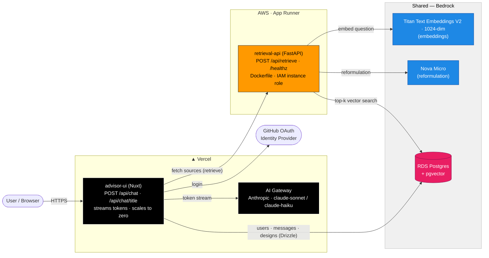

# Infrastructure

Terraform for the AWS side of the AKS Architect demo. 

> [!IMPORTANT]
> As of 18 July 2026 only the **shared infrastructure (incl. IAM)** is deployed, and only partially:
> - **VPC** and relevant configs, e.g. subnets, security groups, and internet gateway.
> - **RDS Postgres**, incl. `pgvector`
> - **IAM Roles & Policies**




## Two IaC Stacks

Per enterprise best practices, there are 2 separate Terraform stacks, which align with typical governance boundary: which team owns what?

| Stack | Ownership | Creates | 
|---|---|---|
| [`./shared/`](./shared/) | App team | VPC (public-only), subnets, IGW, route table, security group, RDS Postgres + parameter/subnet groups, generated DB password | 
| [`./iam/`](./iam/) | Platform/CoE team | Execution/instance roles + policies for the pipeline Lambdas and the retrieval API | 

> [!NOTE]
> The AWS Lambda design has changed since optimizing the RAG pipeline and the roles and policies are stale. See [`./iam/`](./iam/) for details.

## How to Deploy

Each stack is a standard terraform project. See individual stack respective `README.md`s for details.

### Step 0 - Configure credentials for local AWS development

Follow [the official AWS documentation on creating a `process` profile](https://docs.aws.amazon.com/cli/latest/userguide/cli-configure-sign-in.html#cli-configure-sign-in-cached-credentials) so the AWS CLI and terraform can piggy back on your authentication user.

In practice, your `~/.aws/config` then looks like this:

```
[profile signin]
login_session = arn:aws:iam::0123456789012:user/username
region = us-east-1

[profile process] 
credential_process = aws configure export-credentials --profile signin --format process
region = us-east-1
```

And as long as you have a valid session and set `AWS_PROFILE=process`, you can use the aws cli and terraform.

### Step 1 - Enable AWS Bedrock Models

LLM resources in AWS are not provisioned in a classical deployment model. Instead, they need to be enabled via a `aws bedrock create-foundation-model-agreement --model-id` command.

To simplify this, just run: 

```bash
make enable-aws-models
```

Or manually check the CLI command from [Makefile](./Makefile) – which is also good security practice.

### Step 2 - Configure each `defaults.auto.tfvars`

***Most*** of it should deploy without much configuration. For example, S3 bucket name needs to be adjusted.

See individual stack respective `defaults.auto.tfvars` for details.

- Configure [`./shared/defaults.auto.tfvars`](./shared/defaults.auto.tfvars)
- Configure [`./iam/defaults.auto.tfvars`](./iam/defaults.auto.tfvars)

> [!IMPORTANT]
> In the next steps, for each stack, you'll run the standard `terraform init` and `terraform plan` commands. But please review each stack's README.md to understand what you are deploying.

Once you've configured each and have a complete mental model of what you are deploying, continue to the next steps.

### Step 3 - Deploy Shared Infra Stack

See [`shared/README.md`](./shared/README.md) for details.

Once deployed, you'll have something like:

| Resource | Name |
|---|---|
| VPC | `skai-vpc` (`10.0.0.0/24`) |
| Public subnets | `skai-public-<az>` ×2 (`10.0.0.0/27`, `10.0.0.32/27`) |
| Internet gateway | `skai-igw` |
| Route table | `skai-public-rt` |
| DB security group | `skai-postgres-sg` (ingress 5432 from `0.0.0.0/0`) |
| DB subnet group | `skai-db-subnet-group` |
| DB parameter group | `skai-postgres17` (family `postgres17`) |
| RDS instance | `skai-postgres-db` (`db.t4g.micro`, Postgres 17, 20 GB gp3, public) |
| DB name / user | `skaidb` / `skai_admin` (password generated, in state, `sensitive`) |

### Step 4 - Deploy IAM Stack

See [`iam/README.md`](./iam/README.md) for details.

Once deployed, you'll have something like this:

| Role | Name | Trust | Grants |
|---|---|---|---|
| Crawlee fn | `skai-crawlee-fn-role` | Lambda | bucket-wide S3, basic Lambda logging |
| Chunking fn | `skai-chunking-fn-role` | Lambda | bucket-wide S3, basic Lambda logging |
| Embed fn | `skai-embed-fn-role` | Lambda | bucket-wide S3, `bedrock:InvokeModel` on Titan, logging |
| Retrieval API | `skai-retrieval-api-role` | App Runner | `bedrock:InvokeModel` on Titan + Nova |


### Step 5 - Initialize DB

The RAG pipeline requires a database with `pgvector` and a table named `chunks`. To do this, we load [/db/init.sql](./../db/init.sql), which currently uses my `pgvector/pgvector:pg17` from [docker-compose.dev.yaml](./../docker-compose.dev.yaml) to avoid installing `psql` locally.

```bash
# See Important note below
docker pull pgvector/pgvector:pg17 
make init-db
```

> [!IMPORTANT]
> **If you have psql installed** - grab the psql command from the `Makefile` as well as RDS DB credentials from `terraform -chdir=shared output -raw` and load [/db/init.sql](./../db/init.sql) that way.

## Continue to RAG Pipeline

Step 6 is to continue to the RAG pipeline

- [rag-pipeline/](./../rag-pipeline/) - original capstone project version from March 2026
- [rag-pipeline/workflows/](./../rag-pipeline/workflows/) - temporalized version from July 2026
