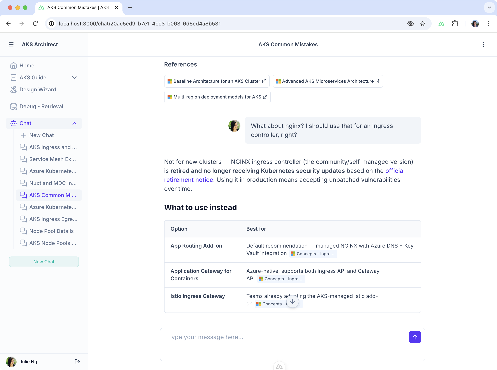
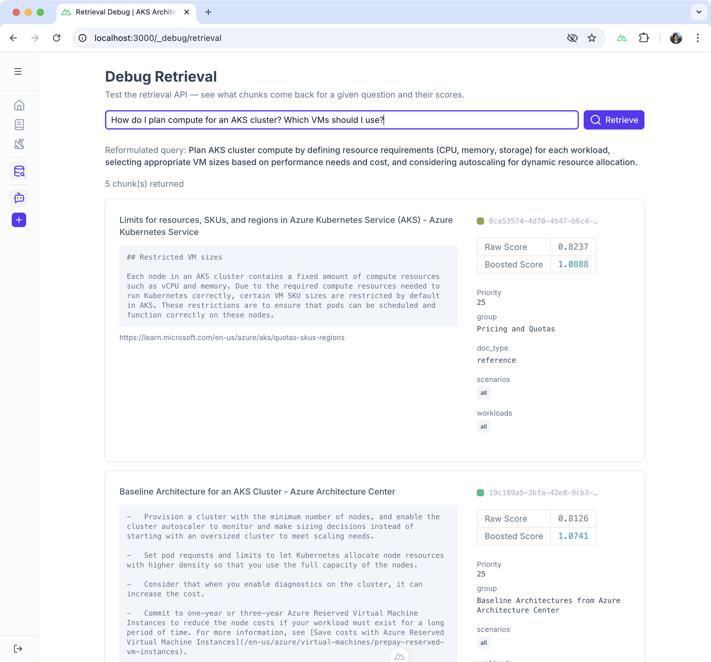
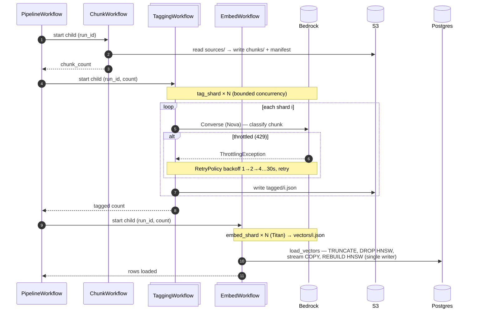

# RAG Pipeline with [Temporal](https://temporal.io/)

_This `spike/temporal` branch explores migrating the app's original RAG pipeline to use Temporal to optimize for speed._

> [!IMPORTANT]
> Much of the design, most notable in diagrams and infra as code includes granular Lambda functions to parallelize workers to speed up the pipeline. That hypothesis was proven wrong and **Lambdas were _not needed_, and thus not implemented**. But it is still scattered around code base as of 18 July 2026.
> 
> For demo and for production, a single monolithic worker produces most cost-efficient results.

> [!NOTE]
> This project is a work-in-progress. This readme describes status as of 18 July 2026.

#### Navigation

To help navigate a large monorepo, these are important deep links to files/directories relevant to this spike.

- 👉 [`/infrastructure/`](./../../infrastructure/)  – included **Terraform code to deploy required AWS infrastructure** (Postgres, S3, AWS Bedrock for LLMs) for demo
- 👉 [`/rag-pipeline/workflows/DEMO.md`](./DEMO.md) – **instructions on how to run this demo**
- [`/rag-pipeline/workflows/`](./) – this directory, which contains all the Temporal Workflows code
- [`/rag-pipeline/README.md`](./../README.md) – describes the OLD sequential pipeline _before_ Temporal spike, which should still work.

## Executive Summary

The initial reasoning was to speed up the original sequential, single worker RAG pipeline from ~1 hour to minutes by leveraging a combination of Temporal and parallelized workers deployed to AWS Lambda functions. 

The migration revealed however, although we reduced the pipeline down to ~30 minutes, **most gains were from fan-outs as concurrency was capped by AWS LLM rate limits**. Temporal's durability, however, accelerated development time with its retries so configuration fine-tuning could pick up where the last activity/shard failed, instead of re-running the entire pipeline.

Temporal doesn't speed up the pipeline. More importantly, it speeds up pipeline _iterations_, e.g. fine-tuning, which is the strongest driver of quality improvement after a data set has been exhausted.

## Why Retrieval-Augmented Generation (RAG)?

The root project of this [aks-architect-ai](https://github.com/julie-ng/aks-architect-ai) repository is **an AI advisor** for designing an Azure Kubernetes Service (AKS) cluster. **Quality is ensured by _grounding_ responses in the official Microsoft documentation**, which is scraped by [/web-scraper](./../web-scraper/README.md).

The running AI chat application demonstrates the added-value of this RAG pipeline (click on screenshots to view full size):

| Chat UI | Debug UI |
|:--|:--|
|  |  |
| LLM responses (including recommendations) are grounded in official Microsoft documentation. | For debugging, users can test how queries and reformulation surface different references based on scores. |

### Anatomy of a RAG pipeline

Broadly speaking, our RAG pipeline has the following stages:

| Stage | Input | Output | Description |
|:--|:--|:--|:--|
| 🧱 **Chunking** | Crawled JSON docs | `chunks.jsonl` | Split markdown by headings, merge/split to target size |
| 🏷️ **Tagging** | `chunks.jsonl` | `tagged_chunks.jsonl` | LLM classifies each chunk against design framework taxonomy |
| 📐 **Embedding into Vectors** | `tagged_chunks.jsonl` | Postgres/pgvector | LLM generate vectors from text, insert into DB with full metadata |

Once in the database, the [`retrieval-api`](./../../retrieval-api/) surfaces the most relevant sources based on user query for the LLM to ground its response.

#### Fragility

A RAG pipeline can fail for many reasons, e.g. throttling, network errors, etc. Even if it runs successfully, it can take a really long time (hours, days) to complete - which slows down iterative improvements to the overall application.

#### Impact

A reliable and speedy RAG pipeline is important because the _real_ value-add to the user of introducing an LLM as an advisor is to **supplement LLMs with _human-driven_ subject matter expertise**. This expertise is applied via curation of [sources](./../web-scraper/SOURCES/), architectural design [taxonomies](./../advisor-ui/content/), and [system prompt](https://github.com/julie-ng/aks-architect-llm-system-prompt).

<details>
  <summary><strong>Details: how the pipeline turns Microsoft docs into searchable, tagged, vectorized chunks</strong></summary>

This specific pipeline converts official Microsoft documentation into a data-format so that an LLM can use [retrieval-api](./../../retrieval-api/) to fetch relevant content chunks to ground its responses. Basically:

- **Pre-requisite: Scraped Docs**  
  After [`/web-scraper/`](./../../web-scraper/), has already scraped the official docs as defined in [`SOURCES`](./../../web-scraper/SOURCES) and outputs JSON format that includes the article contents as markdown. See example [sources/000000042.json](https://skai-pipeline-store-test-f440010.s3.eu-west-1.amazonaws.com/sources/000000042.json) 

- **Chunking Stage**  
  Deterministic workflow that splits the markdown by headings, e.g. `###`

- **Tagging Stage**  
  The chunks are tagged according to [an AKS design framework taxonomy](./../#design-framework-taxonomy), which results in something like this after tagging stage:
  ```json
  {
    "source_name": "landing-zone-accelerator",
    "priority": 15,
    "tags": {
      "group": "Landing Zone Accelerator",
      "workloads": ["landing-zone", "all"],
      "scenarios": ["enterprise"]
    }
  }
  ```

- **Embedding Stage**  
  The text chunks, incl. metadata are embedded into vectors and saved to Postgres DB.

Once in the database, the chunks are surfaced via queries through the [retrieval-api](./../../retrieval-api/).
</details>

## Pipeline - Before & After Temporal Comparison

> [!NOTE]
> As of 18 July 2026, all pipeline runs of the [143 source document set](https://skai-pipeline-store-test-f440010.s3.eu-west-1.amazonaws.com/?list-type=2&prefix=sources/) were run using local workers on a MacBook Pro (M3 Pro, 11-core CPU, 14-core GPU, 36GB RAM). Your mileage may vary depending on your hardware.

| | Old Pipeline | Temporalized Pipeline |
|:--|:--|:--|
| Source Documents | 143 | 143 |
| DB Instance Size | `db.t4g.micro` | `db.t4g.micro` |
| Workers | 1 | 1 |
| Duration | ~1 hour | ~25–30 minutes |
| Resiliency | Manual `sleep`s | Built-in retries + backoff |
| Recovery | Start over from scratch | Resume the failed stage/shard |

## Workflow Design

I started by mapping the existing pipeline onto Temporal 1:1:

- Each stage became a workflow.
- Every model call and I/O became an activity.
 
A parent `PipelineWorkflow` chains the three stage workflows under one `run_id`. Here is a real run (143 docs → 3,496 chunks, zero failures):

| Type | Workflow | Duration | Events |
|:--|:--|--:|--:|
| Parent | [`PipelineWorkflow`](./pipeline/workflow.py) | 30m 31s | 32 |
| Child | [`ChunkWorkflow`](./chunk/workflow.py) | 20s | 11 |
| Child | [`TaggingWorkflow`](./tag/workflow.py) | 20m 17s | 20,846 |
| Child | [`EmbedWorkflow`](./embed/workflow.py) | 9m 52s | 20,651 |

Each stage workflow is **independently startable** — you can re-tag without re-chunking. That's also why there is a standalone [`LoadVectorsWorkflow`](./embed/load_vectors_workflow.py): it recovers from a database bottleneck by re-loading existing vectors, without re-embedding over 3,000 chunks.

### Event Limits

Temporal workflows have 50k event history limit.

- **Capstone Dataset: 143 documents** — Splitting the stages into separate child workflows keeps each event history small, well under the limit.

- **Original Dataset: 700+ documents** would exceed the limit. It is solvable with [`Continue-As-New`](https://docs.temporal.io/workflow-execution/continue-as-new), but out of scope for this spike.

### Queue Design

Work is split across three task queues **by what constrains it**, not by cost:

| Queue | Runs | Constraint | Retry Policy |
|:--|:--|:--|:--|
| `bedrock-queue` | [`tag_shard`](./tag/activities/tag_shard.py), [`embed_shard`](./embed/activities/embed_shard.py) | Rate-limited by Nova / Titan quotas | Backoff + retry (throttles are transient); fail fast on `ValidationException` |
| `db-queue` | [`load_vectors`](./embed/activities/load_vectors.py) | Single writer (`max_concurrent_activities=1`) | Bounded retries (idempotent reload) |
| `default` | workflows + [`chunk_documents`](./chunk/activities/chunk_documents.py), [`read_chunk_count`](./manifest_activity.py) | Unconstrained | Bounded retries (a missing artifact is a real bug, not Temporal's unlimited default) |

> [!NOTE]
> `load_vectors` is a single writer because it does a full refresh — `TRUNCATE` the `chunks` table, then bulk-load every vector. Concurrent writers would corrupt each other (e.g. one truncating mid-load of another).

### Data by Reference (S3)

Workflows pass only small values (`run_id`, shard index, counts) — **never bulk data**, which would blow Temporal's 2 MB payload limit. Every stage hands off through S3 instead, under a per-run prefix:

```
s3://<bucket>/<run_id>/{chunks,tagged,vectors}/NNNN.json
```

Each stage is the **producer** of its own shards — it writes fan-out-ready files the next stage reads directly, so the stages stay decoupled. The `run_id` correlates all of a run's artifacts, and each shard file is addressable on its own — which is what makes independent re-runs and recovery possible.

## Workflow Sequence

The `tag` and `embed` stages **fan out** (bounded concurrency); `load_vectors` is a **single serialized writer** that rebuilds the pgvector HNSW (Hierarchical Navigable Small World) index once after the bulk load. An API throttle just triggers the `RetryPolicy` backoff — the run continues.



## Performance

Migrating to Temporal was also an exercise in finding where the time actually went. Numbers are at **3,040 chunks** (the final end-to-end run at 3,496 is noted).

### Bottlenecks

- **The LLM stages are rate-limit-bound, not compute-bound.**   
  Bedrock quotas aren't adjustable on-demand: 
  - Nova **400 RPM** (a ~7.6-min hard floor for 3,040 chunks)
  - Titan **300K TPM**.  

  At concurrency 10, tagging exceeded Nova's RPM ~5× → **54 throttle events**.
- **The DB load's real cost was hidden.**   
  The load looked DB-bound at ~14 min, but the bottleneck was actually **3,040 sequential S3 reads** (~25 s per 100 shards) — not the write.

### Solutions

- **Fan-out (sharding)** collapsed the compute/IO-bound stages: chunk **~15 min → 16.6 s**.
- **Tuning concurrency to the quota** (tag=3, embed=4) beat throwing more at it
  - At concurrency 3, tagging ran ~8 min near the hard floor. 
  - Counter-intuitive: _**less** concurrency was **faster**_, because we stopped fighting the rate limiter.
- **Binary `COPY` + 20-way parallel S3 reads** fixed the load once we saw where the time went: **13m 55s → 15.6 s (~53×)**.

### Result

#### Reduced Execution Time by 50%

**~1 hour → ~30 minutes** end-to-end (3,496 chunks, one command, zero intervention). But almost all of that gain was **concurrency, not Temporal** — the rate limit is a floor we can't cross, and we'd have hit the same speed with plain thread pools.

#### The Target Architecture Is Simpler Than Planned

The spike started out designed for one Lambda per workflow. But once the bottlenecks turned out to be AWS quotas and a single DB — not compute — that granularity bought nothing. A **single monolithic worker** is the most performant *and* cheapest option, so the planned Lambda architecture isn't needed. The stale Lambda scaffolding still lingers in the diagrams and IaC (see the note at the top).

## Durability – Where Temporal Actually Pays Off

If the speed-up was concurrency, why Temporal? Because everything above was only *possible* — and *survivable* — thanks to what Temporal gives out of the box. Three things earned it, each from a real incident on this project.

### Retries & Backoff

The rate limit became a **non-event**, not a failure:

- 54 Nova throttles during one tagging run — every one retried with backoff, **zero permanent failures, zero manual intervention** (max retry attempt = 2).
- A misconfigured second worker's activities failed mid-run; the healthy worker simply completed them on retry.
- The old pipeline crashed the whole run on the first unhandled throttle.

### Resume, Don't Restart

Because stages hand off through S3, a failure resumes **only the failed part** — no redoing expensive work:

- The `load_vectors` activity died twice mid-load (once a laptop sleep severed the DB connection, once a too-short timeout cancelled it). Both times the embed fan-out had already finished, so recovery was a **`load-vectors`-only re-run — no re-embedding**, via `LoadVectorsWorkflow`.
- The old pipeline had no such seam: a crash meant re-running a ~3040-line `.jsonl` from scratch.

### Observability

Temporal's event history is **how we found the tuning**:

- It surfaced all 54 throttles, their retry counts, and which shards backed off — that's what revealed we were 5× over the Nova quota and pointed us to concurrency=3.
- Without that visibility, the sequential loop's `[2623/3040]` print told us nothing about *why* it stalled.

## Conclusion – Focus on Quality, not Speed

This was already a working pipeline, so my instinct was "if it isn't broken, don't fix it". But the RAG pipeline **is** the value-add — without it, this AKS advisor is just a chat with a good LLM. The difference is **human-curated guidance** grounded in scattered official docs.

I'd avoided touching the pipeline precisely because it was slow: a long run is idle time I could spend on features that reach users faster. It's critical, but invisible. I set out to speed up the _whole pipeline_ — and only during the migration realized the speed that mattered was **iteration** on individual steps, which is exactly what Temporal's resume-where-it-crashed durability unlocks.

Before Temporal, I was limited to optimizing for speed. Now with Temporal, I can optimize for _quality_.
