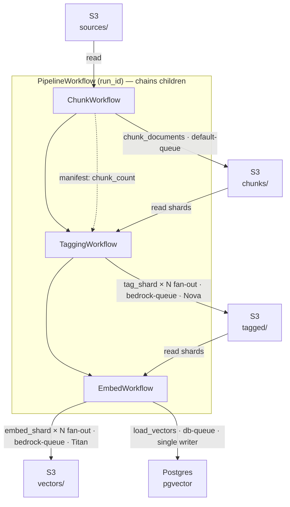
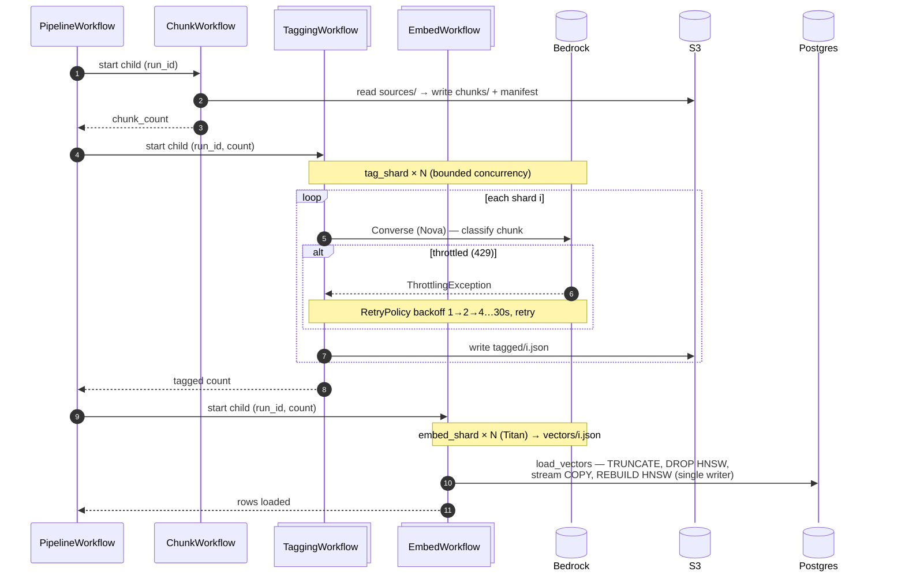

# Temporal Orchestration for the RAG Pipeline

> [!IMPORTANT]
> This is a draft, describing project status as of 17 July 2026:
> - Old CLI, local disk and [ollama](https://ollama.com/) driven RAG pipeline in `./rag-pipeline/` still works
> - Newer Temporal + AWS driven workflows live in `./rag-pipeline/workflows/`, but still use a few methods from the old python files.

The offline pipeline (chunk → tag → embed → load) is orchestrated with
[Temporal](https://temporal.io). Each stage is a workflow; model calls and I/O are activities.

```
sources (S3) → chunk → tag (Bedrock Nova) → embed (Bedrock Titan) → load (Postgres/pgvector)
```

**Why:** the pipeline is long-running, makes thousands of rate-limited API calls, and is re-run
often by engineers tuning RAG quality. Temporal doesn't make it faster (concurrency does that,
and AWS quotas cap the speed) — it makes hitting the rate limit a **non-event**: retries, backoff,
and durable resume survive throttling, crashes, and even a laptop sleeping mid-run.

## Architecture

```
PipelineWorkflow(run_id)              parent — one run_id, chains children
├── ChunkWorkflow      → chunk_documents            reads S3 sources → chunk shards + manifest
├── TaggingWorkflow    → tag_shard(run_id, i)       fan-out: Nova → tagged/{i}.json
└── EmbedWorkflow      → embed_shard(run_id, i)     fan-out: Titan → vectors/{i}.json
                       → load_vectors(run_id, n)    single serialized activity → Postgres
LoadVectorsWorkflow    → load_vectors               re-load S3 vectors, no re-embed (recovery)
```

### Topology — workflows, queues, and S3 hand-off

Each stage reads the previous stage's shards from S3 and writes its own, so bulk data
never crosses a Temporal payload boundary. `LoadVectorsWorkflow` (not shown) is a
recovery variant that runs `load_vectors` alone against existing `vectors/` — no re-embed.



### Runtime flow over time — fan-out and retry

Tag and embed **fan out** (bounded concurrency, drawn as collections); `load_vectors` is
a **single serialized writer**. A throttle just triggers the RetryPolicy's backoff — the
durability point: hitting the rate limit is a non-event, not a failure.



Design decisions:

- **Per-stage workflows, independently startable** — re-tag without re-chunk, etc. Keeps each
  workflow's event history separate (well under Temporal's 50K-event limit).
- **Data by reference, never through payloads** — shards live in S3; workflows pass only small
  values (run_id, index, counts). Bulk data through a payload hits the 2 MB limit.
- **Producer owns sharding** — each stage writes fan-out-ready shards the next reads directly.
- **Task queues split by throttled resource:** `bedrock-queue` (tag+embed, rate-limited),
  `db-queue` (`max_concurrent_activities=1` — enforces single-writer), `default` (cheap/local).
- **Per-activity RetryPolicy by failure nature:** bedrock 8 attempts + backoff (throttles are
  transient; `ValidationException` non-retryable); db-load 2 (idempotent TRUNCATE+reload);
  local 3 (missing artifact = real; bounded, not Temporal's unlimited default).
- **Bounded fan-out + early abort** — a per-stage `Semaphore` caps concurrency (tuned per quota);
  a failure counter aborts the stage past `max(20, 2%)`.
- **Single serialized DB load (Option A)** — `TRUNCATE → DROP HNSW → bulk COPY → REBUILD HNSW`.
  Building the index once (not per-insert) keeps the small RDS instance from saturating I/O. The
  load streams a binary `COPY` fed by a bounded 20-way S3 read-ahead window: reads parallelize,
  the COPY writer stays single-threaded (the window bounds worker memory; the `db-queue`
  single-writer bounds Postgres write concurrency — separate concerns).

## Running locally

```bash
temporal server start-dev                                  # 1. dev server
caffeinate -i uv run python -m workflows.worker            # 2. worker (caffeinate: don't sleep)
uv run python -m workflows.starter                         # 3. full pipeline (fresh run_id)
#   --stage chunk|tag|embed|load-vectors  --run-id <id>    #    or a single stage
```

**Fast iteration** — full runs are ~25 min; use the ~10% sample:

```bash
make pipeline/sample-sources          # build sources-sample/ (15 docs) in S3
export SOURCES_PREFIX=sources-sample  # restart worker to pick up; runs in seconds
```

Config (env-overridable, see `config.py` / `.env.sample`): `TEMPORAL_ADDRESS`,
`TEMPORAL_TAG_CONCURRENCY=3` (Nova 400 RPM), `TEMPORAL_EMBED_CONCURRENCY=4` (Titan 300K TPM),
`SOURCES_PREFIX`, `LOG_LEVEL` (`debug` = per-shard). Logs are structured JSON (queryable in
CloudWatch Logs Insights when workers move to AWS).

## Findings at full scale (3040 chunks, real AWS)

**Speed is concurrency, not Temporal:**

| Stage | Sequential | Fan-out | Performance constraint |
|---|---|---|---|
| Chunk | 14m 43s | **16.6 s** | parallel S3 I/O (thread pool), not Temporal |
| Tag | 36m 22s | **9m 21s** | concurrency, quota-capped |
| Embed + Load Vectors | 17m 27s | fan-out + **15.6 s** load | 13m 55s (executemany) → 15.6 s (COPY + parallel reads) |

**The DB load: the bottleneck moved twice.** The load started at 13m 55s (`executemany`).
Switching to binary `COPY` alone barely helped (~12m 57s) — because the real cost was no longer
the DB write but **3040 sequential S3 reads** (~25 s per 100 shards). Parallelizing those reads
(a bounded 20-way read-ahead) removed that floor: **13m 55s → 15.6 s, ~53×**. The lesson is to
measure where time actually goes, not where you assume it does.

**The rate limit is the ceiling, not compute.** Bedrock quotas are not adjustable on-demand:
Nova 400 RPM (a ~7.6 min hard floor for 3040 chunks), Titan 300K TPM. The tag run at concurrency
10 exceeded Nova RPM ~5× → **54 throttle events, zero permanent failures, zero manual
intervention** (max retry = 2). The fix was tuning concurrency to the quota (tag=3, embed=4), not
more compute — more workers/Lambda would only throttle harder.

**Durability, proven by accident (real incidents, no data loss):**
1. A misconfigured second worker's activities failed; the healthy worker completed them on retry.
2. 54 Bedrock throttles during tagging — all retried and cleared.
3. Two `load_vectors` failures, both client-side (the DB itself stayed healthy — inserts ran at a
   steady rate throughout): once the laptop slept and severed the connection, once the activity's
   10-min timeout was too short and Temporal cancelled it mid-load. Because the embed fan-out had
   already finished (vectors safe in S3), recovery was a `load-vectors`-only re-run — no
   re-embedding — via `LoadVectorsWorkflow` (after bumping the timeout to 30 min).

## Next steps

- **Phase 4:** workers → Lambda + Temporal Cloud. Lambda's value is scale-to-zero cost,
  not speed (bottlenecks are AWS quotas + a single DB). ~$0.50 for a full day of scale testing.
