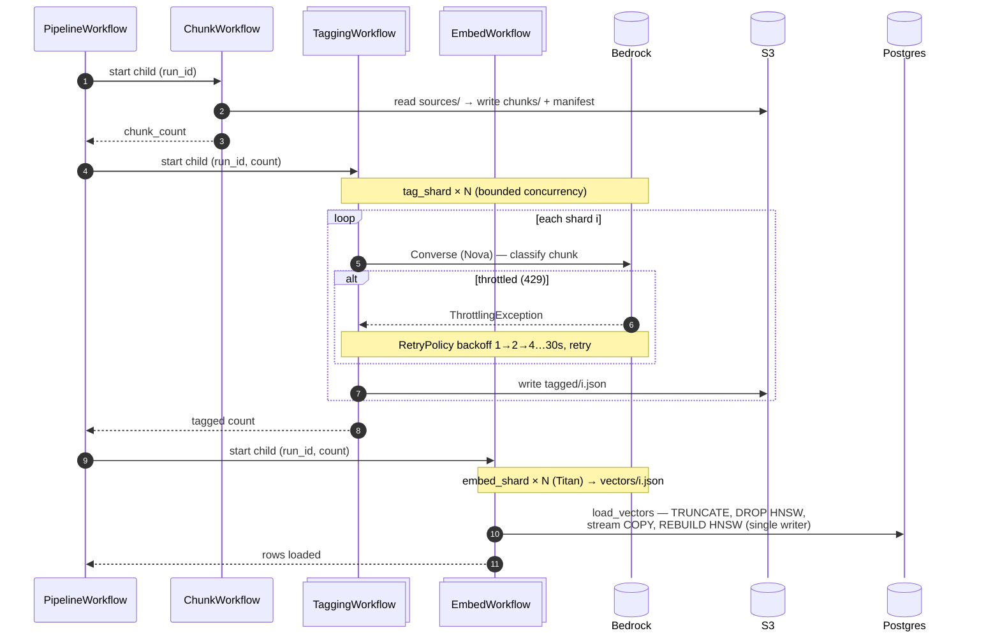

# RAG Pipeline with [Temporal](https://temporal.io/)

_This `spike/temporal` branch explores migrating the app's original RAG pipeline to use temporal to optimize for speed._

> [!IMPORTANT]
> This project is a work-in-progress. This readme describes status as of 18 July 2026.

### Summary

The initial reasoning was to speed up the original sequential, single worker RAG pipeline from ~1 hour to minutes by leveraging a combination Temporal and parallelized workers deployed to AWS Lambda functions. 

The migration revealed however, although we reduced the pipeline down to ~30 minutes, most gains were from fan-outs as concurrency was capped by AWS LLM rate limits. Temporal's durability, however, accelerated development time with its retries so configuration fine-tuning could pick up where the last shared failed, instead of re-runing a long pipeline.

## Why Retrieval-Augmented Generation (RAG)?

The root project of this [aks-architect-ai](https://github.com/julie-ng/aks-architect-ai) repository is **an AI advisor** for designing an Azure Kubernetes Service (AKS) cluster. **Quality is ensured by _grounding_ responses in the official Microsoft documentation**, which is scraped by [/web-scraper](./../web-scraper/README.md).

The running AI chat application demonstrates the added-value of this RAG pipeline (click on screenshots to view full size):

| Chat UI | Debug UI |
|:--|:--|
|  |  |
| LLM responses (including recommendations) are grounded in offiical Microsoft documentation. | For debugging, users can test how queries and reformulation surface different references based on scores. |

### Anatomy of a RAG pipeline

Broadly speaking, our RAG pipeline has the follwowing stages:

| Stage | Input | Output | Description |
|:--|:--|:--|:--|
| 🧱 **Chunking** | Crawled JSON docs | `chunks.jsonl` | Split markdown by headings, merge/split to target size |
| 🏷️ **Tagging** | `chunks.jsonl` | `tagged_chunks.jsonl` | LLM classifies each chunk against design framework taxonomy |
| 📐 **Embedding into Vectors** | `tagged_chunks.jsonl` | Postgres/pgvector | LLM generate vectors from text, insert into DB with full metadata |

Once in the database, the [`retrieval-api`](./../../retrieval-api/) surfaces the most relevant sources based on user query for the LLM to ground its response.

#### Fragility

A RAG pipeline can fail for many reasons, e.g. throttling, network errors, etc. Even if it runs successfully, it can take a really long time (hours, days) to complete - which slows down iterative improvements to the overall application.

#### Impact

A reliable and speedy RAG pipeline is important because the _real_ value-add to the user of introducing an LLM as an advisor is to **supplement LLMs with _human-driven_ subject matter expertise**. This expertise is applied via curation of [sources](./../web-scraper/SOURCES/), architectural design [taxonomies](./../advisor-ui/content/), and [system prompt](https://github.com/julie-ng/aks-architect-llm-system-prompt).

## Why Temporal?

The initial reasoning was to speed up the RAG pipeline. At the capstone stage, the pipeline was already relatively stable thanks to self-throttling via `sleep`s.

> [!IMPORTANT]
> Much of the design, most notable in diagrams and infra as code includes granular Lambda functions to parallelize workers to speed up the pipeline. That hypothesis was proven wrong and **Lambdas were _not needed_, and thus not implemented**. But it is still scattered around code base as of 18 July 2026.
> 
> For demo and for production, a single monolithic worker produces most cost-efficient results.

## Before – Previous Pipeline

It worked. But it was slow.

This project initially crawled the Microsoft Docs and found ca. 700 pages (out of thousands) relevant to AKS that our AI app could use for RAG. It needed to run overnight.

At Bootcamp finish, the pipeline status:

…

## After – Temporalized Pipeline

Newer Temporal + AWS driven workflows live in [`./rag-pipeline/workflows/`](.), but still use a few methods from the old python files.

### Workflow Architecture

Each stage reads the previous stage's shards from S3 and writes its own, so bulk data
never crosses a Temporal payload boundary. `LoadVectorsWorkflow` (not shown) is a
recovery variant that runs `load_vectors` alone against existing `vectors/` — no re-embed.

```
PipelineWorkflow(run_id)              parent — one run_id, chains children
├── ChunkWorkflow      → chunk_documents            reads S3 sources → chunk shards + manifest
├── TaggingWorkflow    → tag_shard(run_id, i)       fan-out: Nova → tagged/{i}.json
└── EmbedWorkflow      → embed_shard(run_id, i)     fan-out: Titan → vectors/{i}.json
                       → load_vectors(run_id, n)    single serialized activity → Postgres
LoadVectorsWorkflow    → load_vectors               re-load S3 vectors, no re-embed (recovery)
```

- Each stage is a workflow
- Model calls and I/O are activities.

### Pipeline Runs — Fan-out and Retry

This squence diagram illustrates how the child workflows and activities are executed. Note:

- The `tag` and `embed` stages **fan out** (bounded concurrency, drawn as collections)
- `load_vectors` is a **_single_ serialized writer**
- An API throttle just triggers the RetryPolicy's backoff
- the durability point: hitting the rate limit is a non-event, not a failure



### Design decisions:

- **Per-stage workflows, independently startable** 
  - re-tag without re-chunk, etc. Keeps each workflow's event history separate (well under Temporal's 50K-event limit).

- **Data by reference, never through payloads**
  - shards live in S3. 
  - workflows pass only small values (run_id, index, counts). 
  - Bulk data through a payload hits the 2 MB limit.

- **Producer owns sharding** 
  - each stage writes fan-out-ready shards the next reads directly.
  
- **Task queues split by throttled resource:** 
  - `bedrock-queue` (tag+embed, rate-limited)
  - `db-queue` (`max_concurrent_activities=1` — enforces single-writer)
  - `default` (cheap/local).
  
- **Per-activity RetryPolicy by failure nature:** 
  - bedrock 8 attempts + backoff throttles are transient; 
  - `ValidationException` non-retryable; 
  - db-load 2 (idempotent TRUNCATE+reload);
  - local 3 (missing artifact = real; bounded, not Temporal's unlimited default).

- **Bounded fan-out + early abort** 
  - a per-stage `Semaphore` caps concurrency 
  - concurrency tuned per quot
  - a failure counter aborts the stage past `max(20, 2%)` – protect the database

- **Single serialized DB load (Option A)** — `TRUNCATE → DROP HNSW → bulk COPY → REBUILD HNSW`.
  Building the index once (not per-insert) keeps the small RDS instance from saturating I/O. The
  load streams a binary `COPY` fed by a bounded 20-way S3 read-ahead window: reads parallelize,
  the COPY writer stays single-threaded (the window bounds worker memory; the `db-queue`
  single-writer bounds Postgres write concurrency — separate concerns).

## Running locally

```bash
temporal server start-dev                                  # 1. dev server
caffeinate -i uv run python -m workflows.worker            # 2. worker (caffeinate: don't sleep)
uv run python -m workflows.starter                         # 3. full pipeline (fresh run_id)
#   --stage chunk|tag|embed|load-vectors  --run-id <id>    #    or a single stage
```

**Fast iteration** — full runs are ~25 min; use the ~10% sample:

```bash
make pipeline/sample-sources          # build sources-sample/ (15 docs) in S3
export SOURCES_PREFIX=sources-sample  # restart worker to pick up; runs in seconds
```

Config (env-overridable, see `config.py` / `.env.sample`): `TEMPORAL_ADDRESS`,
`TEMPORAL_TAG_CONCURRENCY=3` (Nova 400 RPM), `TEMPORAL_EMBED_CONCURRENCY=4` (Titan 300K TPM),
`SOURCES_PREFIX`, `LOG_LEVEL` (`debug` = per-shard). Logs are structured JSON (queryable in
CloudWatch Logs Insights when workers move to AWS).

## Findings at full scale (real AWS)

The story is chronological — each step built on the last, and each taught something different.

Numbers below are at **3040 chunks** unless noted; the final end-to-end run is at **3496**.

1. **Sequential baseline.**
   - Each stage timed on its own: chunk+tag **36m 22s**, embed+load **17m 27s**.
   - The natural first implementation (`for chunk in chunks: …`) — no concurrency.

2. **Fan-out (concurrency 10).**
   - Tagging dropped to **9m 21s**.
   - But Temporal's history showed **54 Bedrock throttle events** (zero failures; every one retried + backed off).
   - The observability is what *revealed* we were ~5× over Nova's 400 RPM limit.

3. **Tuned to the quota (concurrency ~3).**
   - Backing concurrency down to match the quota cut the throttle-and-backoff churn → **~8 min**, near Nova's ~7.6-min hard floor.
   - Counter-intuitive but real: *less* concurrency was faster, because we stopped fighting the rate limiter.

4. **Load: the bottleneck moved twice.**
   - `executemany` **13m 55s** → binary `COPY` **12m 57s** (barely helped — the cost had moved to sequential S3 reads) → COPY + 20-way parallel reads **15.6 s**.
   - See "The DB load" below.

5. **Full end-to-end (3496 chunks).**
   - One `PipelineWorkflow`, one command: **30m 32s**, chunk_count 3496, **0 tag failures, 0 intervention.**

### Speed is concurrency, and it's capped by AWS quotas — not Temporal

- The wins in steps 2–4 are thread-pool / `asyncio` concurrency, not Temporal.
- Compute/IO-bound work (chunk, load) collapses from minutes to seconds.
- Quota-bound work (tag on Nova 400 RPM, embed on Titan 300K TPM) hits a floor concurrency can't beat.
- **Temporal's contribution is not on this axis** — it's the observability that *enabled* the step-2→3 tuning, and the durability that made 54 throttles a non-event.

### The DB load: the bottleneck moved twice

- Started at **13m 55s** (`executemany`).
- Binary `COPY` alone barely helped (**~12m 57s**) — the real cost was no longer the DB write but **3040 sequential S3 reads** (~25 s per 100 shards).
- Parallelizing those reads (a bounded 20-way read-ahead) removed that floor: **13m 55s → 15.6 s, ~53×**.
- Lesson: measure where time actually goes, not where you assume it does.

### The rate limit is the ceiling, not compute

- Bedrock quotas are not adjustable on-demand: Nova **400 RPM** (a ~7.6-min hard floor for 3040 chunks), Titan **300K TPM**.
- The tag run at concurrency 10 exceeded Nova RPM ~5× → **54 throttle events, zero permanent failures, zero manual intervention** (max retry = 2).
- The fix was tuning concurrency to the quota (tag=3, embed=4), not more compute — more workers/Lambda would only throttle harder.

### Durability, proven by accident (real incidents, no data loss)

- A misconfigured second worker's activities failed; the healthy worker completed them on retry.
- 54 Bedrock throttles during tagging — all retried and cleared.
- Two `load_vectors` failures, both client-side (the DB itself stayed healthy — inserts ran at a steady rate throughout):
  - once the laptop slept and severed the connection;
  - once the activity's 10-min timeout was too short and Temporal cancelled it mid-load.
  - Because the embed fan-out had already finished (vectors safe in S3), recovery was a `load-vectors`-only re-run — no re-embedding — via `LoadVectorsWorkflow` (after bumping the timeout to 30 min).

## Next steps

- **Phase 4:** workers → Lambda + Temporal Cloud.
  - Lambda's value is scale-to-zero cost, not speed (bottlenecks are AWS quotas + a single DB).
  - ~$0.50 for a full day of scale testing.
