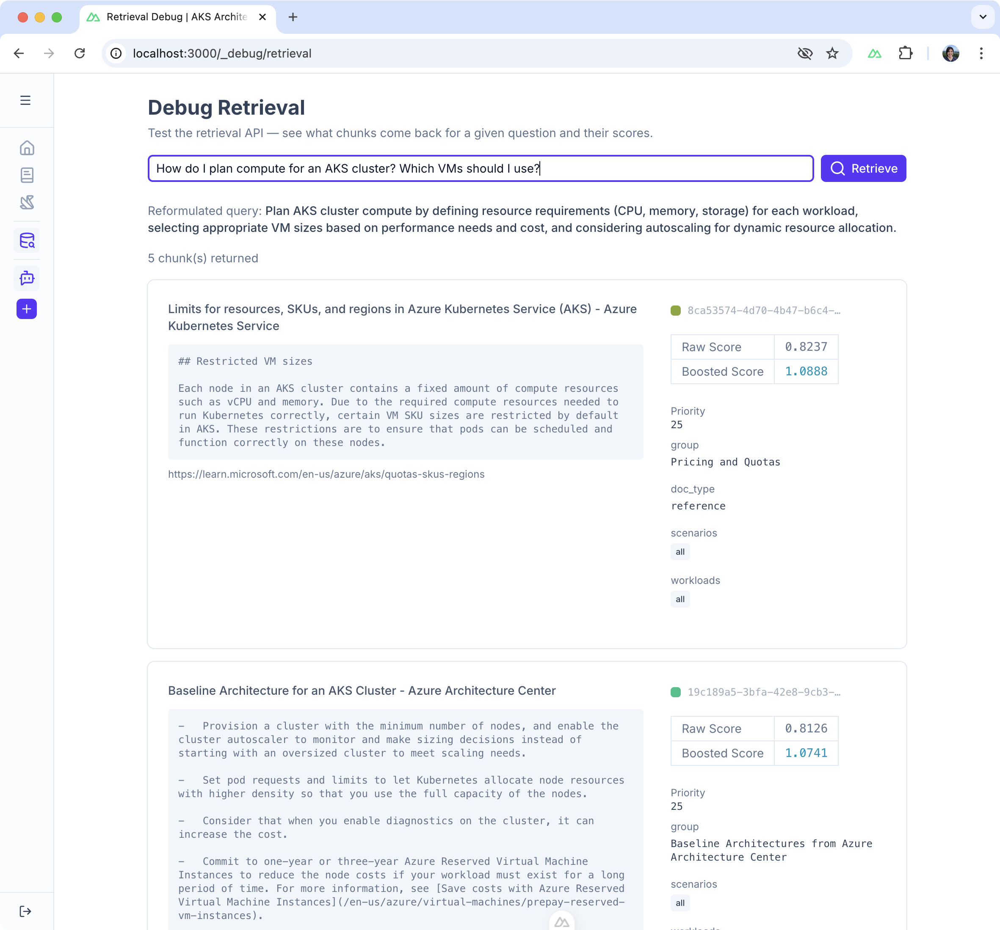

# Retrieval API

This is the **retrieval** backend service powered by FastAPI.

### Features

- **Query reformulation** — rewrites user questions for specificity and technical terminology before search
- **Query-time embedding** — converts questions to vectors (`search_query:` prefix) for cosine similarity search against chunked docs
- **Priority-boosted re-ranking** — blends vector similarity with human-curated source priority scores
- **Conversation-aware** — uses chat history for contextual reformulation (e.g. resolving "it" → "AKS networking plugin")

## Local Development

> [!NOTE]
> This component has dependencies, including a database with [pgvector](https://github.com/pgvector/pgvector) for vector similarity search for Postgres. See parent [README.md](./../README.md) about using the [`docker-compose.dev.yaml`](./../docker-compose.dev.yaml) file to start up the entire stack.

### Demo

You can see how this works at [http://localhost:3000/_debug/retrieval](http://localhost:3000/_debug/retrieval). Type in queries and see which chunks are returned with scores, etc.

| | Text |
|:--|:--|
| **User Query** | How do I plan compute for an AKS cluster? Which VMs should I use? |
| **Reformulated** | Plan AKS cluster compute by defining resource requirements (CPU, memory, storage) for each workload, selecting appropriate VM sizes based on performance needs and cost, and considering autoscaling for dynamic resource allocation. |
| **Priority-boosted Re-ranking** | 1) AKS Specific documentation for VMs, which is direct match  2) Baseline Architecture guidance - which is not direct match, but intentional to surface this official reference architecture via boosting. |

> [!TIP]
> The **colored squares** are the first 6 characters of the chunk UUID as a HEX color - to help visualize **distinct chunks** from the _same document_, esp. long AKS baseline architecture document.

## API Endpoints

| Method | Path | Description |
|:--|:--|:--|
| `POST` | `/api/retrieve` | Reformulate → embed → search vector DB → return chunks |
| `GET` | `/healthz` | IETF-style health check (vector DB + Ollama connectivity) |

## Configuration

All settings via env vars (pydantic-settings). Defined in [`app/config.py`](./app/config.py).

| Env Var | Default | Description |
|:--|:--|:--|
| `DATABASE_URL` | See [`docker-compose.dev.yaml`](./../docker-compose.dev.yaml) | Postgres DB URL |
| `EMBEDDING_MODEL` | `nomic-embed-text` | Ollama embedding model |
| `EMBEDDING_PREFIX` | `search_query: ` | Prefix prepended to queries before embedding |
| `DOCUMENT_PREFIX` | `search_document: ` | Prefix for document embedding (used in pipeline, not API) |
| `CHAT_MODEL` | `gemma3:4b` | Ollama model for chat + reformulation |
| `CORS_ORIGINS` | `["http://localhost:3000"]` | Allowed CORS origins |
| `RETRIEVAL_TOP_K` | `5` | Number of chunks returned after re-ranking |
| `PRIORITY_BOOST_WEIGHT` | `0.1` | How much priority influences ranking (see [Weights](#weights)) |
| `OPENAPI_DOCS_ENABLED` | `False` | Enable Swagger UI at `/docs` |

## Retrieval Process

1. Fetch `top_k * 3` candidates from database by cosine similarity
2. Re-rank using priority boosting
3. Trim to `top_k` (default: 5)
 
The extra candidates ensure high-priority chunks can overtake slightly-more-similar low-priority ones.

## Ranking Sources

This section describes how we are combining official docs with human curation and handwritten docs.

### Source Priority

Used tiered, categorical.

| Category | Number (Range) | Description |
|:--|:--|:--|
| Neutral | 10 | Default for crawled docs |
| Recommended | 20 | Hand-picked official docs, satisfy most use cases, offer good balance |
| Curated | 50 | My own written docs |

N.B. Use orders of magnitude (1, 10, 100) only for dramatic separation. Overkill here since `log()` already compresses the scale.

> [!IMPORTANT]
> If the priorities are adjusted in the [`SOURCES/`](./../web-scraper/SOURCES/) directory, you'll need to rebuild the vector index. See [`Makefile`](./../Makefile) for appropriate commands.

### Boosted Scores

The current setup:

| Priority | log(priority) | Boost Factor (weight=0.1) |
|:--|:--|:--|
| 10 | 2.3 | 1.23 |
| 20 | 3.0 | 1.30 |
| 50 | 3.9 | 1.39 |

### Weights

Formula: `boosted = similarity * (1 + log(priority) * weight)`

The `weight` is set via `PRIORITY_BOOST_WEIGHT` env var (default: `0.1`).

- **weight = 0** — priority ignored, pure similarity ranking
- **weight = 0.1** — gentle nudge, priority matters but similarity still dominates
- **weight = 0.2** — stronger, priority-50 content beats similarity-matched priority-10 content more aggressively

Example: priority-50 chunk (similarity 0.70) vs. priority-10 chunk (similarity 0.74):

| Weight | Priority 50 @ 0.70 | Priority 10 @ 0.74 | Winner |
|:--|:--|:--|:--|
| 0.0 | 0.70 | 0.74 | Priority 10 |
| 0.1 | 0.97 | 0.91 | Priority 50 |
| 0.2 | 1.25 | 1.08 | Priority 50 (by more) |
